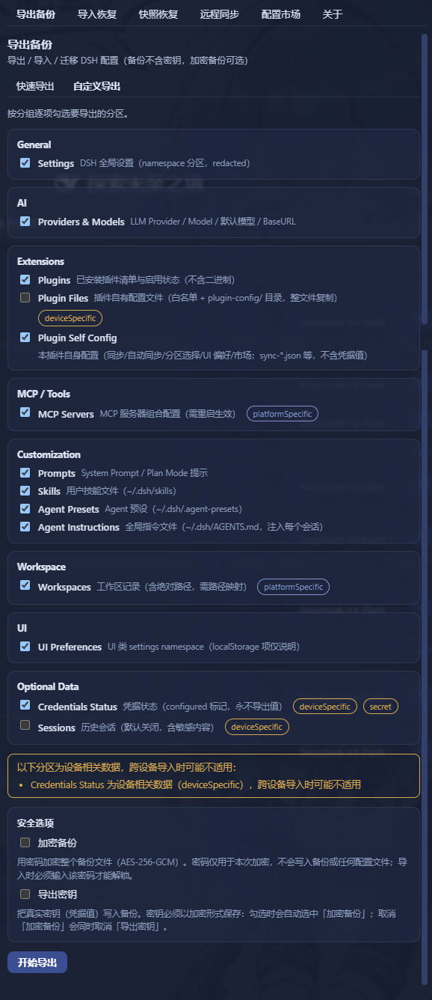
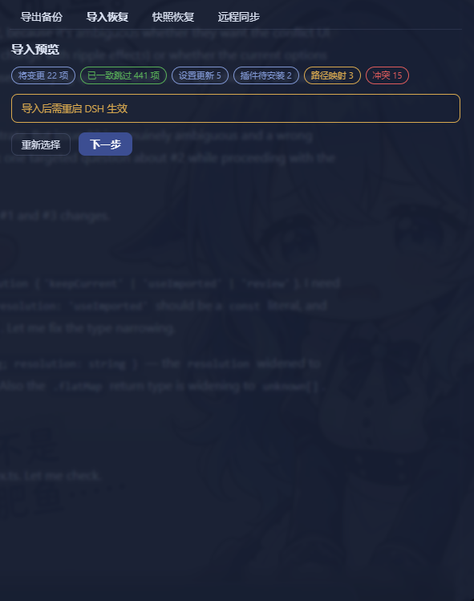
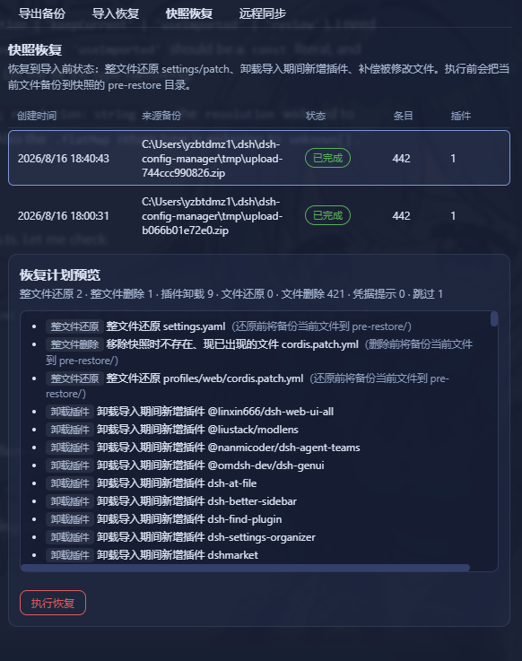
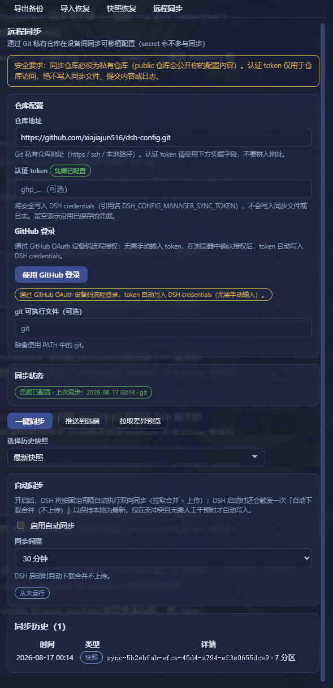
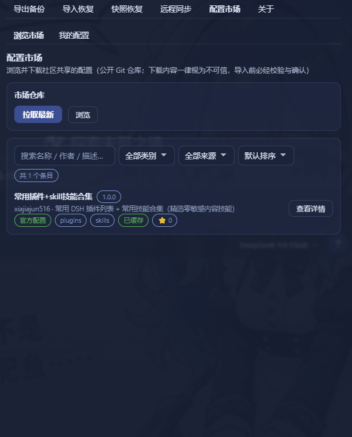

# 🎒 DSH Config Manager

**DeepSeek Harness Backup, Restore & Migration Plugin.**

Backup, restore, export, import, migrate and sync your complete DeepSeek Harness (DSH) configuration — settings, model providers, plugins, MCP servers, skills, agent presets and workspaces — and restore your whole environment on a new machine with one click.

- 🔄 **Backup & Restore** DeepSeek Harness configuration
- 📦 **Export / Import** complete DSH configuration
- 🚚 **Migrate** DSH to another machine
- ⏰ **Scheduled full backups** — automatic, on your own cadence (6h / 12h / 24h / 7d / custom weekly), secrets never included
- 🔌 Backup installed **plugins** and plugin configuration
- 🧩 Backup **MCP servers** and **Skills**
- 🔐 Encrypted backups with optional credentials
- ☁️ **Git / WebDAV** configuration sync
- 🛒 **Configuration market** — browse & one-click install shared configs
- ↩️ Automatic snapshot and rollback before restore

[English](README.md) · [简体中文](README.zh-CN.md)

---

## What is this? 🤔

DSH is your AI assistant workbench — it holds your settings: model configs, plugins, skills, workspaces…

**DSH Config Manager is its "moving service"**:

```
┌──────────────┐   ① one-click    ┌─────────────────┐   ② one-click    ┌──────────────┐
│  Machine A    │ ──── export ───► │ dsh-config.zip   │ ──── import ───► │  Machine B    │
│  my config    │                  │   (one file)     │                  │  all restored │
└──────────────┘                  └─────────────────┘                  └──────────────┘
```

> ⚠️ **Security first**: no secrets (API Key / Token / Password) are exported by default. See [Security](#-security).

---

## 🎯 Use Cases

### Backup DeepSeek Harness configuration

Create a portable backup of your DSH settings, model providers, plugins, MCP servers, skills, agent presets, profiles and workspace — one ZIP file, no secret values included by default.

### Restore DeepSeek Harness on another machine

Export your current DSH environment as a single ZIP and import it on a new Windows, macOS or Linux machine. One click brings back settings, plugins, MCP servers, skills and global instructions (AGENTS.md).

### Migrate DSH configuration to a new computer

Move your complete DeepSeek Harness setup without manually reinstalling plugins, MCP servers and skills. Dead absolute paths are detected and remapped automatically (batch prefix mapping supported).

### Sync DSH configuration across machines

Keep portable configuration synchronized between machines through a private Git repository or WebDAV — secrets do not sync by default (the payload is run through the SecretScanner); check "Export secrets" with an encryption password and `~/.dsh/.credentials.yaml` travels as scrypt + AES-256-GCM ciphertext inside the encrypted snapshot, so another machine can restore the credentials while the remote (Git host / WebDAV provider) only ever sees ciphertext.

### Schedule automatic full backups

Turn on scheduled backups (6h / 12h / 24h / 7d — or a **custom weekly weekday & time**) and DSH quietly keeps a fresh full backup of your configuration in the background — secrets are never included, so it stays safe on disk without a password. Consecutive failures are highlighted in red in the settings card.

### Discover & install configurations from the marketplace

Browse the built-in official market for ready-made configurations (model providers, plugins, MCP servers, skills, agent presets…), preview what would be imported (dry-run), and install with one click — supply-chain warnings are always shown and every section must be explicitly approved before anything is written.

---

## ✨ Highlights

| Icon | Feature | In one line |
|:---:|---|---|
| 🚀 | **One-click Export** | Package your recommended config into a ZIP |
| 📦 | **One-click Import** | Restore your environment on another machine |
| 👀 | **Preview before import** | Full preview first — **never touches your config silently** |
| ⚔️ | **Conflict handling** | Keep Current / Use Imported — you decide |
| 🗺️ | **Path auto-mapping** | Detects dead absolute paths and lets you remap them |
| 🔒 | **Secret safety** | API Keys are not exported by default — non-encrypted imports ask you to re-enter; encrypted backups restore them with the password |
| ↩️ | **Automatic rollback** | Failed import restores everything automatically |
| 📸 | **Snapshot restore** | Undo an import: whole-file restore + uninstall added plugins (CLI & GUI) |
| 🔄 | **Remote Sync** | Push/pull portable config via **Git private repo or WebDAV** (secrets do not sync by default; encrypted snapshots can optionally carry encrypted credentials) |
| ⏰ | **Scheduled backups** | Full backup on a fixed cadence (6h / 12h / 24h / 7d) — set-and-forget, secrets never included |
| 🛒 | **Config Marketplace** | Browse & one-click install community configs — supply-chain warnings + per-section approval |
| 🗂️ | **Profiles** | Save multiple setups (Work / Personal) and switch anytime — preview + auto-backup + rollback |
| 🌐 | **Bilingual UI** | Interface, reports and error details follow the DSH app language (中文 / English) |
| 🤖 | **Agent tools** | Backup / snapshot / restore / sync right from an agent session |

---

## 📸 Screenshots

| Export | Import Preview |
|:---:|:---:|
|  |  |

| Snapshot Restore | Remote Sync |
|:---:|:---:|
|  |  |

| Configuration Market |
|:---:|
|  |

---

## 🔄 How it works?

### Export (pack it up)

```
Read your config → strip secrets (safe) → build manifest → compute checksums → pack into ZIP
```

### Import (restore the environment)

Every step confirms and backs up first — **it never modifies your config directly**:

```
Select ZIP → validate file → check integrity → check schema → compatibility check
    → scan contents → build import plan → preview & confirm
    → auto-backup current config → apply → validate → done
                      │
                      └─ failed midway? → automatically restored (rollback)
```

---

## 📥 Installation

It's a standard **DSH plugin** — two steps:

```bash
# ① Install the plugin
dsh plugin --profile web add dsh-config-manager@latest

# ② Restart DSH (a "Backup & Migration" entry appears in Settings)
```

> 💡 Just copy-paste the command: `@latest` ensures you get the newest build.
>
> 🐛 **`@latest` installed an old version?** That's pnpm 11's `minimumReleaseAge` supply-chain policy, not a cache issue: versions published less than ~30 days ago are excluded from resolution until whitelisted. Two fixes:
> - Install an exact version once (it auto-whitelists, then `@latest` works):
>   ```bash
>   dsh plugin --profile web add dsh-config-manager@0.1.8
>   ```
> - Or disable the age gate with a one-liner (adds `minimumReleaseAge: 0` at the top of the profile's `pnpm-workspace.yaml`):
>   ```powershell
>   $f = "$env:USERPROFILE\.dsh\profiles\web\pnpm-workspace.yaml"
>   $c = Get-Content $f -Raw
>   if ($c -notmatch '(?m)^minimumReleaseAge:') {
>     Set-Content -LiteralPath $f -Value ("minimumReleaseAge: 0`n" + $c) -Encoding utf8
>     Write-Output "Added minimumReleaseAge: 0"
>   } else {
>     Write-Output "Already present, nothing to do"
>   }
>   ```

---

## 🚀 Quick start (3-minute tour)

```
Machine A (export)
  1. Open DSH → Settings → "Backup & Migration"
  2. Click "Export Configuration" → choose "Quick Export"
  3. You get dsh-config-2026-08-14.zip (the report confirms no secrets inside)

Copy the ZIP to Machine B (import)
  1. Open DSH → "Backup & Migration" → "Import Configuration"
  2. Select the ZIP → wait for analysis → review the "Import Preview"
  3. Path issues? → choose new paths (batch mapping supported)
  4. Conflicts? → choose Keep Current / Use Imported
  5. Confirm import → wait
  6. Re-enter any missing API Keys as prompted
  7. ✅ Settings / plugins / MCP / skills / workspace / global instructions (AGENTS.md) are back
```

---

## 🧩 Features

### 📤 Export (two modes)

| Mode | Description |
|---|---|
| **Quick Export** (recommended) | One-click: settings / UI / models / plugins / MCP / skills / agent presets / global instructions (AGENTS.md) / workspaces… |
| **Custom Export** | Tick the categories you want |

> Output: `dsh-config-<date>.zip` with manifest + per-category data + SHA-256 checksums.

**Export extras:**
- **Preview before export** — see what will be packaged (section count + estimated size, no secrets) before anything is written
- **Custom file name & note** — name the ZIP yourself (auto-naming is the default) and attach an optional note that shows in the **Backup Files** list (the note travels with the self section when you sync/backup the config)

### 📥 Import (safe flow)

- **Nothing is written before confirmation** — analyze & preview are zero-write
- **Backup before applying** — the target config is snapshotted automatically
- **Automatic rollback on failure** — full rollback or skip-and-continue, your choice
- **Next-steps checklist after import** — the result page lists what needs a DSH restart (per plugin/MCP), credentials to re-enter, and failed/skipped items you can retry

### 👀 Import Preview (dry run)

Shown fully before importing:

```
✓ 18 settings will be updated    ✓ 6 plugins already installed
⚠ 2 plugins need installation    ⚠ 3 secrets need re-entry
⚠ 1 path needs mapping           ⚠ 2 conflicts need attention
```

### ⚔️ Conflict handling

When the target already has a same-named item, you choose:

| Option | Meaning |
|---|---|
| **Keep Current** | Leave the target's config untouched |
| **Use Imported** | Overwrite with the backup's value |

> Note: a "decide later / review" option is intentionally **not** offered — an undecided conflict would block the import from proceeding. Every conflict must be resolved before continuing.

### 🗺️ Path mapping

`C:\Users\alice\projects` doesn't exist on the new machine? The plugin:
1. Detects the dead absolute paths automatically
2. Lets you pick new paths
3. Supports **batch prefix mapping** (`C:\Users\alice\` → `/Users/bob/` in one shot)

### 🔒 Secrets

| Scenario | Behavior |
|---|---|
| Default backup | **No secret values at all** — only records which keys are needed |
| Encrypted backup (explicit opt-in) | scrypt + AES-256-GCM, random salt & IV per export; secrets never leave as plaintext, and the password is **never written to the file** |
| Encrypted backup import | The export-time password is required: enter → verify → credentials are restored; **no password, no import** |
| After non-encrypted import | "3 secrets need re-entry" — values stay in memory only |

### 🔄 Remote Sync (Git / WebDAV)

Push / pull your portable config between machines through **either of two channels** — usage is identical except for the transport itself:

| | Git private repo | WebDAV |
|:---:|---|---|
| **Endpoint** | `repoUrl` | `webdav.url` |
| **Credentials** | auth token in DSH credentials (`DSH_CONFIG_MANAGER_SYNC_TOKEN`) | `username` stored in the config (echoed in the UI); **password never synced / never logged** — DSH credentials `DSH_CONFIG_MANAGER_SYNC_WEBDAV_PASSWORD` |

- **Same snapshot retention for both channels**: only the newest **10** snapshots are kept on the remote (`MAX_REMOTE_SNAPSHOTS=10`); older ones are deleted automatically.
- **Switching channels starts fresh**: Git and WebDAV do **not** share snapshots or a common ancestor. When you switch transport, sync begins again from the new remote's empty baseline — push a fresh snapshot first.
- **WebDAV auth** uses HTTP Basic: the `username` is stored in the config and may be echoed back into the UI, while the `password` is read live from the DSH credentials slot `DSH_CONFIG_MANAGER_SYNC_WEBDAV_PASSWORD` — it never appears in any sync file or log.
- **Plugins auto-install**: when pulling diffs, plugins that are new in the backup are **installed automatically** on confirm — no manual per-item ticking in the diff list. Only **version-conflict** plugins still ask you to pick "Keep Current / Use Imported".
- **Push preview before uploading** — the Push button first shows a read-only preview of what will be sent (sections + per-section counts + changed-vs-baseline markers, first-baseline notice) and only writes the remote after you confirm.
- **Secrets do not sync by default**: every section goes through the `SecretScanner` (sensitive field values stripped) and the credential section is structurally excluded. With "Export secrets" checked and an encryption password set, `~/.dsh/.credentials.yaml` travels as scrypt + AES-256-GCM ciphertext in a **separate credentials payload** of the encrypted snapshot (never inside any section); the receiving side decrypts it into per-ref "credential migration" items that are written back to the local credential store (`credentials.set`) only after you confirm. The password is memory-only and never persisted or logged; **auto sync never carries credentials** (it has no password and skips encrypted snapshots).

### 🛒 Configuration Marketplace

Browse and install ready-made configurations (model providers, plugins, MCP servers, skills, agent presets…) shared by the community:

- **Built-in official market** — read-only, bound to the official public repo (official badge shown, not editable); first open auto-refreshes, manual refresh also available
- **Search & filter** — keyword search (matches name / description / author / **categories**), category filter, **section filter** (items already downloaded list their sections; others are excluded with a hint), source filter (Official / Community), sorting (recently updated / most starred / name A–Z), and a ⭐ badge showing the **source repo's** star count (queried anonymously, no token involved)
- **Impact preview** — the detail view shows "what installing this will change" (items updated / identical / conflicts / secrets to re-enter / DSH restart needed) before you approve anything
- **Supply-chain warnings always shown** — source repo URL, "not officially reviewed", download time; **per-section approval** — high-risk sections (sessions / arbitrary files) are banned from listing outright, and every remaining section must be explicitly approved before the import is confirmed
- **Install reuses the safe import pipeline** — analyze → preview → auto-backup → apply → rollback; nothing is written before you confirm
- **"My Configs"** — sign in with GitHub (device flow), upload a config to **your own public repo** in one click, and an **auto listing PR** is opened against the official market repo; manage your listings (status badges: not listed / PR pending / listed), update in one click, install back locally, or delist (auto de-listing PR)

### 🗂️ Profiles

Save multiple configurations (Work / Personal) and switch anytime; switching includes preview + auto-backup + rollback.

- **Save current config** — pick a name and store the current DSH configuration (settings / providers / plugins / skills / agent presets…; no secrets, file sections embedded)
- **Switch with safety** — preview first (zero writes) → confirm → automatic snapshot → staged apply; any failure rolls back fully
- **Manage** — rename / delete (confirmed) / import an exported profile.json
- Library is an independent tab: Settings → "Backup & Migration" → **Profiles**

### 📸 Snapshot restore (undo an import)

Every import creates a **safety snapshot** first. If something feels off afterwards, restore the target back to its pre-import state:

| Action | What it does |
|---|---|
| Whole-file restore | settings.yaml / settings.json / cordis.patch.yml blobs are written back to `$DSH_HOME`; files that didn't exist at snapshot time but appeared after import are removed |
| Plugin uninstall | Plugins added during import are removed via the official `dsh plugin remove` (baseline comparison; old snapshots without a baseline only get a hint) |
| File compensation | skills / agentPresets / agentInstructions / pluginFiles / sessions blobs are written back to their original paths |
| Credentials | DSH never reads credential values back — you get a manual re-entry hint instead |

**GUI**: Settings → "Backup & Migration" → **Snapshots & Restore** tab → pick a snapshot → preview the plan (dry-run, zero writes) → confirm.

**Snapshot management:**
- **Retention is visible** — up to **10** snapshots are kept automatically (oldest pruned); the hint is shown in the list
- **Pin important snapshots** — a pinned snapshot is exempt from auto-pruning and can only be deleted manually
- **Manual delete** — remove any snapshot (danger, confirmed) when you no longer need that rollback point

**Backup Files management** (same tab → "Backup Files"):
- List every export ZIP (manual + scheduled) with source badge, size, time and your custom **note**
- **Search** by file name or note
- **Inspect / Compare** — read-only preview of what the backup contains (sections + per-section counts) and the diff against your current config (zero writes) before deciding to import

---

### 🚨 CLI — the first line of defense when DSH is broken

The GUI lives *inside* DSH — it can't help you if DSH won't start. The `dsh-config-manager` **CLI is completely independent of the DSH runtime** (pure Node + the core engine, **zero `@deepseek-ai/*` imports** — it runs even when the DSH peer packages are broken or missing). That makes it your **first rescue tool** when the config is corrupted, the GUI won't boot, or you changed machines and need to bring an environment back.

It is a standalone npm tool, **installed separately from the plugin**. Install it once on any machine that might need rescuing:

```bash
# --omit=peer: the offline CLI only needs js-yaml, not the DSH peer packages
npm install -g dsh-config-manager@latest --omit=peer
```

> ⚠️ Installing/updating the plugin (`dsh plugin --profile web add ...`) only enables the GUI — it does **not** create the `dsh-config-manager` command. Run the install command above, then any of the commands below.

All commands (also shown by `dsh-config-manager help`):

```text
dsh-config-manager help                                        # list all commands & options
dsh-config-manager snapshots [--data-dir <dir>]                # list snapshots (newest first)
dsh-config-manager restore [--id <id>] [--dry-run]
                           [--profile <name>] [--settings <path>]
dsh-config-manager reinstall [--version <v>] [--yes] [--list]
                             [--wipe-config] [--dry-run]       # one-click reinstall of DSH itself
dsh-config-manager recover-stale-lock [--data-dir <dir>]       # clear a leftover lock (see below)
dsh-config-manager verify [--id <file|path>] [--json]         # read-only check of backup ZIPs
                          [--data-dir <dir>]
dsh-config-manager backup [--sections <a,b,c>] [--out <path>] # offline file-level backup
                          [--dry-run] [--data-dir <dir>]
```

**`reinstall` — rescue when DSH is broken.** It reinstalls the `@deepseek-ai/dsh` launcher across platforms (uses the right command per OS: PowerShell on Windows, bash on Unix). By default it reinstalls the launcher + clears global caches; interactively it asks which **dangerous** clean-up items to include (settings / plugins / session data & credentials) — those are **not** selected by default, and any destructive choice requires a second confirmation by typing `YES` before anything runs. Before wiping any `~/.dsh` data it makes an emergency backup at `.reinstall-backup` (the `snapshots/` folder is deliberately never touched).

```bash
# see the selectable clean-up items
dsh-config-manager reinstall --list

# interactive: pick items, confirm, then reinstall DSH
dsh-config-manager reinstall

# non-interactive: everything checked, skip confirmation
dsh-config-manager reinstall --yes

# wipe config data too (equivalent to checking all data items) — interactive confirm still required
dsh-config-manager reinstall --wipe-config

# preview the exact plan without running anything
dsh-config-manager reinstall --dry-run
```

**Snapshot restore.** List and restore the safety snapshots (offline — the restore engine is part of the CLI, so it works whether or not DSH can start):

```bash
dsh-config-manager snapshots                                  # list snapshots (newest first)
dsh-config-manager restore --dry-run                          # preview the plan (zero writes)
dsh-config-manager restore --id <snapshot-id>                 # execute (current files are backed up first)
```

Every overwrite/delete is first copied to `<snapshotDir>/pre-restore/` so you can manually change your mind. Exit code is `1` if any action failed; the report honestly lists restored / removedPlugins / manualHints / failed / skipped.

**`verify` — is that old backup still usable?** The GUI lives inside DSH, so it cannot answer this when DSH will not start; `verify` can. It re-reads a backup ZIP from disk **without writing a single byte**, then reports one verdict per file:

| Verdict | Meaning |
|---|---|
| `OK` | Structurally valid and every entry matches its SHA-256 in `integrity/checksums.json` |
| `MISSING` | The file is not there (wrong path / already deleted) |
| `CORRUPT` | Damaged or tampered — the message names the exact offending entry |
| `UNSUPPORTED` | A valid backup this plugin version cannot read (schema too new, or an encrypted container that must be decrypted first) |
| `VERIFY_ERROR` | The check itself failed (disk I/O); never downgraded to a guess |

With no argument it checks **every** `*.zip` in the exports directory; pass a file name or a path to check just one. Exit code is `1` unless **all** checked backups are `OK` — which makes it safe to assert from CI or a scheduled task. `--json` prints the same result machine-readably.

```bash
dsh-config-manager verify                # check every backup in the exports directory
dsh-config-manager verify --json         # machine-readable (exit code still 0/1)
dsh-config-manager verify my-backup.zip  # check a single file by name
dsh-config-manager verify C:/backups/dsh-config.zip   # ...or by path
```

**`backup` — backup even when DSH is down.** This is the offline counterpart of the GUI export: it packs the parts of `$DSH_HOME` that can be read **without the DSH runtime** (skills, agent presets, agent instructions, and the plugin’s own config) into a ZIP with the same structure as a GUI export (`manifest.json` + `integrity/checksums.json` + section directories), then immediately self-checks what it wrote with the same engine as `verify` — a backup command that never verified its own output would be worse than none.

**Credential files never enter a backup.** `.credentials.*`, `.env`, `*.pem` and friends are excluded by an explicit blacklist, only whitelisted directories are walked (never the whole home directory), and symlinks are skipped rather than followed.

Structured sections (settings / UI / providers / plugins / MCP / prompts / workspaces) are **not** silently faked: they need the DSH service layer to read and redact, so they are left out and marked `false` in the manifest — the plan printout lists them under “not offline-collectable” so you know exactly what this backup does and does not contain. Use the GUI export when DSH is healthy for a full backup.

```bash
dsh-config-manager backup --dry-run                       # list what would be packed (zero writes)
dsh-config-manager backup                                 # write into the exports directory, then self-check
dsh-config-manager backup --out D:/rescue/config.zip      # explicit destination (never overwrites)
dsh-config-manager backup --sections skills,self          # narrow the scope
```

`--sections` accepts `skills,agentPresets,agentInstructions,self,pluginFiles`. `pluginFiles` is **opt-in** (as in the GUI): it copies third-party plugin files verbatim, and `dsh-ssh.json` holds plaintext host passwords — select it only when you have looked at what is in there.

**A typical rescue flow** when DSH won't start: ① `dsh-config-manager reinstall` to bring the launcher back (plus any clean-up), ② `dsh web` to start DSH again, ③ re-add the plugin from the registry, and ④ pull a snapshot from the remote repo (or run `dsh-config-manager restore`) to bring your config back. The CLI works at every step regardless of DSH's health.

**`recover-stale-lock` — when every operation suddenly fails.** Before touching your config, the plugin claims a small environment lock (it records who is operating plus a heartbeat) so that two operations can never write your config at the same time. If a `dsh web` process is **force-killed** (Task Manager, `kill -9`), the lock file survives with a dead owner: the next operation is refused, and it stays refused **no matter how often you retry or restart DSH** — because the plugin deliberately never removes a lock on its own (a wrong guess could evict a live operation).

Symptoms and the fix:

| Symptom | Meaning | Fix |
|---|---|---|
| 「另一个任务正在运行，请稍后重试。」 / "Another task is running, please retry." | A live operation holds the lock | Just wait — it clears itself |
| 「检测到上次异常退出残留的配置锁…重试或重启 DSH 均无效」 / relayed in the log as `自动同步已跳过` | The owner process is **proven dead** (leftover lock) | Run the command below, or use GUI **Recovery → 事故恢复 → 回收残留锁** |
| Same message, but the owner PID was **reused** by an unrelated process (common on Windows) | The heartbeat has been stale for a very long time, so the lock is still classified as a leftover one | Same fix — a heartbeat that has not been refreshed for far longer than the stale window is now reclaimable |

```bash
# safe: it inspects first and refuses unless the owner is proven dead (a live lock is never touched)
dsh-config-manager recover-stale-lock
```

**Plugins installed but the backup doesn't see them?** Check **Settings → DSH Config Manager → About**: it now shows which directory / profile the plugin list was read from, and how many plugins were detected. The list comes from `$DSH_HOME/profiles/<profile>/package.json` → `dependencies` (plus anything declared in `dsh.profile.bundles` that is not a dependency), where `<profile>` is resolved as `config.profile` → `--profile` → `web`. If the shown path is not the profile you installed into (Desktop builds may use a different profile or a different `DSH_HOME`), that is the cause — align `--profile` / `DSH_HOME` with it.

### 🌐 Behind a proxy? (GitHub login / sync)

Node's built-in `fetch()` does **not** read `HTTP_PROXY` / `HTTPS_PROXY` by default, so on networks where GitHub is only reachable through a local proxy, "Sign in with GitHub" would previously fail with `请求 GitHub 设备码失败：fetch failed` even though your browser and `git` work fine.

**The plugin now routes its own outbound requests through your proxy automatically** — just make sure the proxy environment variables are visible to the DSH process:

```bash
# macOS / Linux — before starting dsh
export HTTPS_PROXY=http://127.0.0.1:7897
export NO_PROXY=localhost,127.0.0.1
dsh web
```

```powershell
# Windows PowerShell
$env:HTTPS_PROXY='http://127.0.0.1:7897'; dsh web
```

How it behaves:

- **Covers all plugin egress**: GitHub API + device-flow login (`fetch`) and WebDAV sync (native `http`/`https`), including `CONNECT` tunnelling for `https` targets;
- **Zero impact when you have no proxy configured** — no proxy variables means no behaviour change at all;
- **`NO_PROXY` is respected** (`*`, exact host, `example.com` suffix, optional `:port`);
- **`DSH_CONFIG_MANAGER_PROXY=off`** forces direct connections even when proxy variables exist;
- Proxy credentials in the URL (if any) are used only for `Proxy-Authorization` and **never logged**; the startup log prints a redacted proxy summary so you can confirm whether routing is active;
- This is **plugin-private**: it never changes global/process-wide network settings (unlike `NODE_USE_ENV_PROXY`, which affects the whole host process including model API calls).

Alternative (host-wide): set `NODE_USE_ENV_PROXY=1` **before starting DSH** (Node 24+); note this also routes the host's own outbound traffic, not just this plugin's.

### 🤖 Agent tools (for AI assistants)

The plugin also registers **5 model tools** that an AI agent (a DSH assistant session) can call directly — the same backup / snapshot / sync engines, no GUI needed:

| Tool | What it does |
|---|---|
| `config_backup` | Full backup of DSH config to the local `exports` dir — **no secrets by default**; pass `password` for an encrypted backup. Returns ZIP name / size / included sections / encryption state |
| `config_list_snapshots` | List local rollback snapshots (id / created / source / status / entry count) for use with `config_restore` |
| `config_restore` | Restore to a snapshot. **Default is a zero-write plan preview**; pass `confirm: true` to actually execute (overwrites / deletes `$DSH_HOME` files and uninstalls plugins added during import — destructive, always preview first) |
| `config_sync_push` | Push config sync to the remote (Git / WebDAV) using the persisted channel config. Writing the remote is an explicit action; encryption / credentials require `password` and the engine forces `encrypt` |
| `config_sync_pull` | Pull a remote diff **preview** (zero-write: download + analyze only). Landing the diff requires the separate confirm-import pipeline |

Once the plugin is installed the tools appear automatically in every agent session (hosts without an agent `tools` service silently skip registration). The agent calls them when the task matches — e.g. "back up my config", "what snapshots do I have", "restore to that snapshot", "sync to my repo" or "show me the remote diff". Safety invariants are built in: `config_restore` is dry-run by default, `config_sync_pull` never writes, `config_sync_push` is an explicit remote write, and secret values never enter tool inputs / outputs / logs.

---

## 🛡️ Security

- **The default backup contains no secret values** — a hard invariant, enforced at export
- **Not exported by default**: API Keys / passwords / tokens / cookies / sessions / device unique ID / logs & cache / plugin binaries
- **A ZIP is untrusted input**: defends against Zip Slip, malicious paths, zip bombs, corrupt archives — any trigger rejects the whole file
- **Logs are fully redacted** — secret values never reach logs
- **Encrypted backup (explicit opt-in)**: secrets are exported only as scrypt + AES-256-GCM ciphertext — random salt & IV per export, never plaintext; the password lives in memory only

---

## 🤝 Compatibility

| Status | Meaning |
|---|---|
| ✅ Excellent | Same platform, complete sections, supported schema |
| 👍 Good | Backup from an older DSH |
| ⚠️ Partial | Cross-platform / missing sections / backup newer than target |
| ❌ Unsupported | Schema beyond the supported range (cannot import) |

---

## ❓ FAQ

**Q: Will my API Key be in the backup?**
Not by default. The default backup **never contains any secret value** — only records which keys you'll need to re-enter. If you explicitly choose an **encrypted backup**, secrets are included, but only as scrypt + AES-256-GCM ciphertext (random salt & IV per export) — never plaintext.

**Q: Will importing overwrite my existing config?**
Not silently. Conflicts ask you to choose (Keep Current / Use Imported); the target is auto-backed-up and can roll back.

**Q: Does it work across platforms (Windows → macOS)?**
Yes. Dead absolute paths are detected and remapped (batch replacement supported).

**Q: Can a corrupted ZIP still be imported?**
No. A checksum mismatch rejects the import outright (protects against corruption or tampering).

**Q: Will re-importing duplicate things?**
No. Items are deduplicated by stable IDs (plugin ID / MCP name / skill name…); existing items are skipped.

**Q: Does importing an encrypted backup require the password?**
Yes. The import wizard asks for the export-time encryption password and verifies it before the import can proceed; the password is never saved — memory only. A wrong or missing password blocks the import (credentials are restored from the backup instead of being re-entered when the password is correct).

---

## 📋 Known limitations (user-facing)

1. **Installing / updating plugins or MCP takes effect after restarting DSH**
2. **Some UI state is not migrated** (e.g. task board data, panel widths — they live in the browser, not in DSH's config files)
3. **keybindings / workflow configs / commands** — DSH has no such concepts, so nothing is exported for them. Global agent rules are covered by **Agent Instructions** (`~/.dsh/AGENTS.md`, injected into every session); per-project `AGENTS.md`/`CLAUDE.md` belong to each project's repo and are not migrated
4. **History/session migration is off by default** (v1 copies files only)
5. **Encrypted backups**: a lost password means the `secrets.enc` can't be decrypted (by design — keep your password safe)
6. **Snapshot restore is offline and honest**: entries the offline engine can't restore (settings namespaces / patch lines when the snapshot has no whole-file backup, workspace records stored in DSH storages) are reported as skipped with a pointer to online rollback; credential **values** are never auto-written (manual re-entry hint only); old snapshots without a plugin baseline only get a hint to remove added plugins manually

> Maintainers & developers: see [DEVELOPERS.md](DEVELOPERS.md) for build, testing, auto-publishing and full technical notes.

---

**Product principles**: better to migrate one config less than to break your existing config. Every import follows `Analyze → Preview → Backup → Apply → Validate → Rollback(if needed)`; every secret follows `never export by default / never log / never expose / never silently transfer`.
