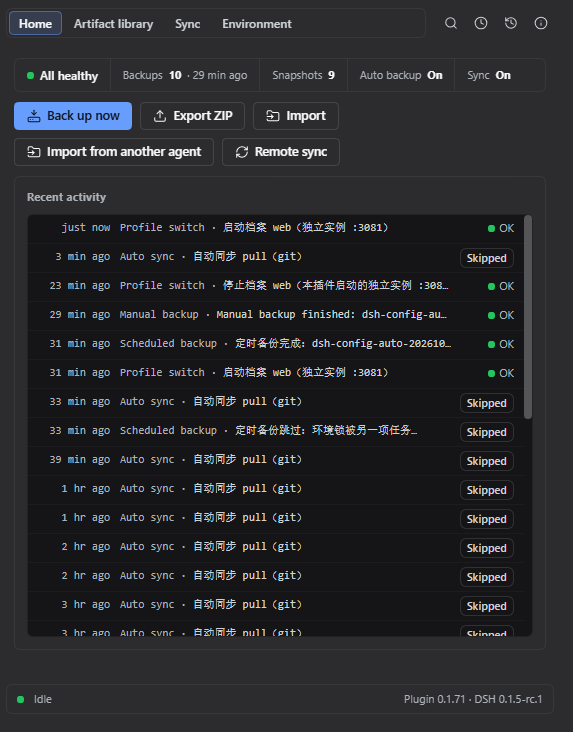
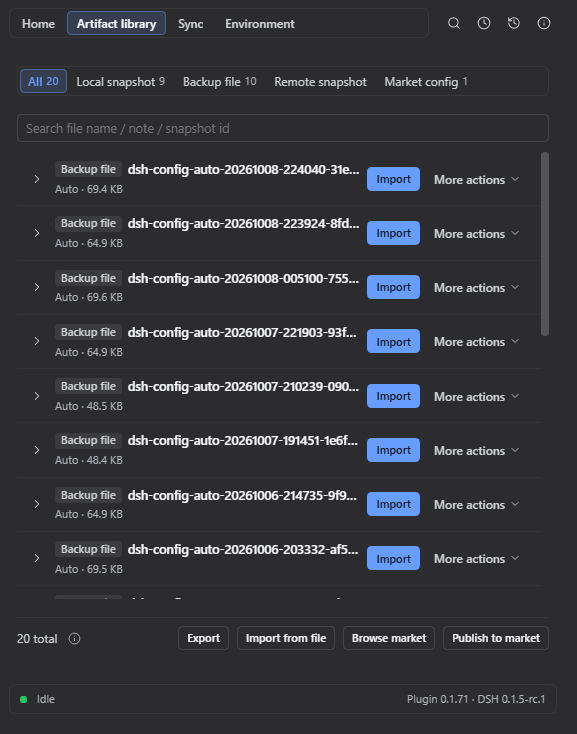
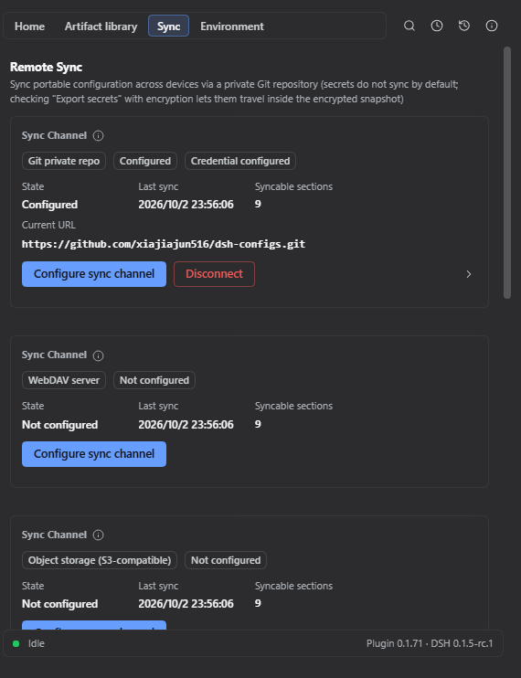
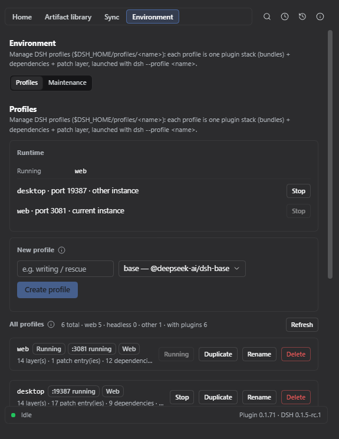

# 🎒 DSH Config Manager

[](https://www.npmjs.com/package/dsh-config-manager)
[](https://www.npmjs.com/package/dsh-config-manager)
[](https://github.com/xiajiajun516/dsh-config-manager/stargazers)
[](https://github.com/xiajiajun516/dsh-config-manager/blob/main/LICENSE)
[](https://github.com/deepseek-ai/deepseek-harness)

**DeepSeek Harness Backup, Restore & Migration Plugin.**

Backup, restore, export, import, migrate and sync your complete DeepSeek Harness (DSH) configuration — settings, model providers, plugins, MCP servers, skills, agent presets and workspaces — and restore your whole environment on a new machine with one click.

- 🔄 **Backup & Restore** DeepSeek Harness configuration
- 📦 **Export / Import** complete DSH configuration
- 🚚 **Migrate** DSH to another machine
- ⏰ **Scheduled full backups** — automatic, on your own cadence (6h / 12h / 24h / 7d / custom weekly), secrets never included
- 🔌 Backup installed **plugins** and plugin configuration
- 🧩 Backup **MCP servers** and **Skills**
- 🔐 Encrypted backups with optional credentials
- ☁️ **Git / WebDAV** configuration sync
- 🛒 **Configuration market** — browse & one-click install shared configs
- 🧳 **Import from other AI agents** — Claude Code, Cursor, Codex, Hermes, Antigravity … config **and chat history**
- ↩️ Automatic snapshot and rollback before restore

[English](README.md) · [简体中文](README.zh-CN.md)

---

## What is this? 🤔

DSH is your AI assistant workbench — it holds your settings: model configs, plugins, skills, workspaces…

**DSH Config Manager is its "moving service"**:

```
┌──────────────┐   ① one-click    ┌─────────────────┐   ② one-click    ┌──────────────┐
│  Machine A    │ ──── export ───► │ dsh-config.zip   │ ──── import ───► │  Machine B    │
│  my config    │                  │   (one file)     │                  │  all restored │
└──────────────┘                  └─────────────────┘                  └──────────────┘
```

> ⚠️ **Security first**: no secrets (API Key / Token / Password) are exported by default. See [Security](#-security).

---

## 🎯 Use Cases

### Backup DeepSeek Harness configuration

Create a portable backup of your DSH settings, model providers, plugins, MCP servers, skills, agent presets and workspace — one ZIP file, no secret values included by default. (DSH's own profiles — `$DSH_HOME/profiles/<name>`, i.e. which plugin stack to boot — are machine-local and are **not** part of the backup; the **Environment → Profiles** view manages them instead — list / create / rename / delete, plus launching or stopping an independent instance for one.)

### Restore DeepSeek Harness on another machine

Export your current DSH environment as a single ZIP and import it on a new Windows, macOS or Linux machine. One click brings back settings, plugins, MCP servers, skills and global instructions (AGENTS.md).

### Migrate DSH configuration to a new computer

Move your complete DeepSeek Harness setup without manually reinstalling plugins, MCP servers and skills. Dead absolute paths are detected and remapped automatically (batch prefix mapping supported).

### Sync DSH configuration across machines

Keep portable configuration synchronized between machines through a private Git repository, WebDAV, an S3-compatible object store (AWS S3 / Alibaba OSS / Tencent COS / MinIO / Qiniu Kodo) or GitHub Gist — secrets do not sync by default (the payload is run through the SecretScanner); check "Export secrets" with an encryption password and `~/.dsh/.credentials.yaml` travels as scrypt + AES-256-GCM ciphertext inside the encrypted snapshot, so another machine can restore the credentials while the remote (Git host / WebDAV / object store / Gist) only ever sees ciphertext.

### Schedule automatic full backups

Turn on scheduled backups in the **Home → Scheduled backup** card (6h / 12h / 24h / 7d — or a **custom weekly weekday & time**) and DSH quietly keeps a fresh full backup of your configuration in the background — secrets are never included, so it stays safe on disk without a password. How many are kept is decided by the **retention policy** in the same card (last N + one per month + one per year), and consecutive failures are highlighted in red.

### Discover & install configurations from the marketplace

Browse the built-in official market for ready-made configurations (model providers, plugins, MCP servers, skills, agent presets…), preview what would be imported (dry-run), and install with one click — supply-chain warnings are always shown and every section must be explicitly approved before anything is written.

### Import from another AI agent (Claude Code, Cursor, Codex, …)

Your setup — and your chat history — already live in another AI coding agent on this machine? Pick the source and DSH Config Manager **translates it into a standard bundle** (MCP servers, skills, global instructions, conversations and the workspaces they belong to) and hands it to the same review-first import flow: preview → per-item conflict decisions → automatic snapshot → apply → rollback. 30 sources are recognized and 29 of them can migrate **chat history** too. Secret **values** are never read — only the key names, so the import plan can ask you to re-enter them.

---

## 🆚 How it differs from the other DSH backup / sync plugins

Several DSH plugins live in this space and they solve different problems — pick the one that matches your situation; they can also coexist.

| Plugin | Strongest at | Where DSH Config Manager goes further |
|---|---|---|
| [xiaoyuyu6420/dsh-backup](https://github.com/xiaoyuyu6420/dsh-backup) | One-command `~/.dsh` snapshots from the CLI, plus session doctor / upgrade snapshots / rescue console | Review-before-write GUI flow (dry-run preview, per-item conflict decisions, automatic rollback), cross-machine path remapping, encrypted credential payload, configuration marketplace |
| [muyifc/dsh-config-sync](https://github.com/muyifc/dsh-config-sync) | Export / import DSH configuration to a portable, password-encrypted file, callable from tool calls | 13–14 sections (plugins / MCP / skills / workspaces / session logs …), scheduled backups, four sync channels (Git / WebDAV / object storage / Gist), session migration with path rebase |
| [dickpy/dsh-cloud-sync](https://github.com/dickpy/dsh-cloud-sync) · [weibaohui/dsh-sync](https://github.com/weibaohui/dsh-sync) | Keeping machines consistent through WebDAV / S3 or a private Git mirror | Sync is one of five capabilities here — alongside export/import, scheduling, marketplace and profile instance launch/stop |
| `cp -r ~/.dsh` (or Git on the home dir) | Free, zero setup, fine for a purely textual config | No secret handling, no path remapping, no capture of `link:` / `file:` plugin installs, no session-log work, no conflict handling or rollback |

**Short version**: for a one-command snapshot of everything, `dsh-backup` is excellent. If what you want is *move this working environment to another machine — and keep it in sync — with a review step before anything is written*, that is exactly what this plugin is for.

---

## ✨ Highlights

| Icon | Feature | In one line |
|:---:|---|---|
| 🚀 | **One-click Export** | Open the export flow — the recommended sections are pre-ticked — and package a ZIP in one click (adjust section by section, item by item if you want) |
| 📦 | **One-click Import** | Restore your environment on another machine |
| 👀 | **Preview before import** | Read the migration consult verdict and its evidence first, then pick content item by item and resolve conflicts one by one — **never touches your config silently** |
| ⚔️ | **Conflict handling** | Keep current / Use backup — you decide (with bulk buttons) |
| 🗺️ | **Path auto-mapping** | Detects dead absolute paths and lets you remap them |
| 🔒 | **Secret safety** | API Keys are not exported by default — non-encrypted imports ask you to re-enter; encrypted backups restore them with the password |
| ↩️ | **Automatic rollback** | Failed import restores everything automatically |
| 📸 | **Snapshot restore** | In the Library, hit "Restore" on a pre-import snapshot: review the line-by-line restore plan, then whole-file restore + uninstall added plugins (CLI & GUI) |
| 🔄 | **Remote Sync** | Push/pull portable config via **Git private repo / WebDAV / S3-compatible object storage / GitHub Gist** — each channel is configured on its own (secrets do not sync by default; encrypted snapshots can optionally carry encrypted credentials) |
| ⏰ | **Scheduled backups** | Full backup on a fixed cadence (6h / 12h / 24h / 7d, or a custom weekly time) — set-and-forget, secrets never included |
| 🛒 | **Config Marketplace** | Browse & one-click install community configs — supply-chain warnings + per-item content selection (change summary + in-place high-risk flags); entry: Library footer "Browse market / Publish to market", or ⌘K |
| 🗂️ | **Profiles (DSH profiles)** | Under **Environment → Profiles**, manage `$DSH_HOME/profiles/<name>` directly: list / create from a shipped template / rename / hard delete / **launch this profile (independent instance)** / **stop the instance** (the row button flips between Launch and Stop with the running state) |
| 🌐 | **Bilingual UI** | Interface, reports and error details follow the DSH app language (中文 / English) |
| 🧩 | **Local plugin migration** | `link:` / `file:` development plugins are packed into the backup, so switching machines does not lose them |
| 🗄️ | **Configurable retention (GFS tiers)** | "keep the last N + one per month + one per year" — the defaults are equivalent to the previous behaviour |
| 🤖 | **Agent tools** | Backup / snapshot / restore / sync right from an agent session |
| 💾 | **Disk usage report** | **Environment → Maintenance & Diagnostics** shows how much space the plugin's own artifacts take (backups / snapshots / sync copies / caches / staging) with a three-tier cleanup policy; **one-click cleanup only touches regenerable caches and expired backups** — snapshots and sync data are never removed there |
| ⬆️ | **Update check** | The About panel (top-right nav icon) reads the latest version from npm (read-only, cached 10 minutes); when there is a newer one it offers a copyable upgrade command **and** a one-click **Update now** that installs exactly that version — DSH must then be restarted, and the plugin never restarts it for you. Offline failures are reported honestly and affect nothing else |
| 🧭 | **Compatibility explained** | Before importing you see "source DSH version / platform → local" plus **structured reasons** for the score (cross-platform / missing sections / newer source …) instead of a bare "partial" |
| 🧳 | **Import from other AI agents** | Read Claude Code / Cursor / Codex / Hermes / Antigravity … configuration **and chat history** on this machine, translate it into a standard bundle, then import through the usual preview / conflict / rollback flow |

---

## 📸 Screenshots

| Home | Library |
|:---:|:---:|
|  |  |

| Sync (four channel cards) | Environment · Profiles |
|:---:|:---:|
|  |  |

---

## 🔄 How it works?

### Export (pack it up)

```
Read your config → strip secrets (safe) → build manifest → compute checksums → pack into ZIP
```

### Import (restore the environment)

Every step confirms and backs up first — **it never modifies your config directly**:

```
Select ZIP → validate file → check integrity → check schema → compatibility check
    → scan contents → build import plan → migration consult (verdict + evidence)
    → choose what to import → per-item conflict decisions → path mapping / secrets re-entry
    → confirm import → auto-backup current config → apply → validate → done
                      │
                      └─ failed midway? → automatically restored (rollback, can be switched off on the confirm page)
```

---

## 📥 Installation

It's a standard **DSH plugin** — two steps:

```bash
# ① Install the plugin
dsh plugin --profile web add dsh-config-manager@latest

# ② Restart DSH (a "Backup & Migration" entry appears in Settings)
```

> 💡 Just copy-paste the command: `@latest` ensures you get the newest build.
>
> 🐛 **If `@latest` installed an old version**: that's pnpm's `minimumReleaseAge` supply-chain policy (not a cache issue). The gate is evaluated **per version, at resolution time**: a release younger than the threshold (~30 days) stays invisible to `@latest` until it ages past it — and the clock restarts for every future release. Installing an exact version once fixes *that one version only*; the next release published is invisible to `@latest` again. It is **not** a one-time fix.
>
> **Permanent fix (recommended)** — exempt this single package from the age gate. Add to the profile's `pnpm-workspace.yaml` (`~/.dsh/profiles/web/pnpm-workspace.yaml`):
>
> ```yaml
> minimumReleaseAgeExclude:
>   - dsh-config-manager
> ```
>
> After that `@latest` resolves the newest release normally — including every future release.
>
> **One-off fix** — ask npm which version is actually latest and install exactly that. Repeat it each time a newer version has been published:
>
> ```powershell
> # Windows (PowerShell)
> $v = (npm view dsh-config-manager version).Trim(); dsh plugin --profile web add "dsh-config-manager@$v"
> ```
>
> ```bash
> # macOS / Linux
> dsh plugin --profile web add "dsh-config-manager@$(npm view dsh-config-manager version)"
> ```
>
> After restarting DSH, **Settings → Backup & Migration → the About icon at the top right** shows the version you are actually running (and pops up the release notes whenever it changes).
>
> - Or disable the age gate entirely with a one-liner (adds `minimumReleaseAge: 0` at the top of the profile's `pnpm-workspace.yaml`):
>   ```powershell
>   $f = "$env:USERPROFILE\.dsh\profiles\web\pnpm-workspace.yaml"
>   $c = Get-Content $f -Raw
>   if ($c -notmatch '(?m)^minimumReleaseAge:') {
>     Set-Content -LiteralPath $f -Value ("minimumReleaseAge: 0`n" + $c) -Encoding utf8
>     Write-Output "Added minimumReleaseAge: 0"
>   } else {
>     Write-Output "Already present, nothing to do"
>   }
>   ```
>
> 🐛 **Install rejected for a version you never installed?** Symptom: pnpm logs `+ dsh-config-manager ^0.1.66`, yet DSH reports `Plugin dsh-config-manager@0.1.44 is incompatible with dsh …` and rolls the install back.
>
> The cause is neither pnpm nor version resolution. After installing, DSH runs a compatibility check that reads this plugin's `cordis.patch.yml` mount row (`name: 'dsh-config-manager'`) and **resolves that package again** — and Node's resolution chain honours `NODE_PATH`. If your global npm root (`npm root -g`) still holds an **old copy of the same package** (for example a `npm i -g dsh-config-manager` of 0.1.44 from earlier), the check compares **that** copy's `peerDependencies` and reports a version pnpm never installed.
>
> Confirm and fix:
>
> ```powershell
> npm ls -g dsh-config-manager         # output means a global copy exists
> npm i -g dsh-config-manager@latest   # upgrade it (or npm uninstall -g dsh-config-manager to remove it)
> ```
>
> Then retry the install. As long as that global copy exists and is incompatible with your DSH, every profile (`web` / `desktop` / custom) is rejected the same way.

### Installing from the GitHub source (`git+https://...`)

When installed from a git source, pnpm first runs this package's `prepare` script (= `npm run build`) inside that clone to produce `lib/` — **npm ships a prebuilt `lib/`, a git install builds it on the spot**. pnpm 11 blocks that script by default, so the install fails with `dsh: plugin command failed` and this in the log:

```
ERR_PNPM_GIT_DEP_PREPARE_NOT_ALLOWED  Failed to prepare git-hosted package ...
The git-hosted package "dsh-config-manager@x.y.z" needs to execute build scripts
but is not in the "allowBuilds" allowlist.
```

**Fix**: copy the exact line pnpm prints (it includes the full git URL and commit sha) into the profile's `pnpm-workspace.yaml`:

```yaml
# ~/.dsh/profiles/web/pnpm-workspace.yaml
allowBuilds:
  dsh-config-manager@git+https://github.com/xiajiajun516/dsh-config-manager.git#<sha printed by pnpm>: true
```

> The key must be copied **verbatim** — the bare package name `dsh-config-manager` does not work (the allowlist matches on source + version).
> The simpler path is the prebuilt npm release above (`dsh-config-manager@latest`), which needs no allowlist at all.

---

## 🚀 Quick start (3-minute tour)

> **Where things are**: there are only 4 top-level pages — **Home** (how this machine is doing, plus the four actions Back up now / Export / Import / Remote sync), **Library** (local snapshots / backup files / remote snapshots / marketplace configs — every "thing" lives in this one list), **Sync** (four channel cards: Git / WebDAV / object storage / Gist) and **Environment** (Profiles / Maintenance & Diagnostics). **Export, import, browse market and publish to market are flow panels**: open them from the Home toolbar or the Library footer, switch pages to collapse, switch back to continue. The four icons at the top right are the ⌘K command palette, activity, migration history and About.

```
Machine A (export)
  1. Open DSH → Settings → "Backup & Migration" → Home
  2. Click "Export" in the toolbar → the recommended sections are already ticked (change them via "Choose what to export")
  3. Click "Start export" → the ZIP is downloaded automatically as dsh-config-<date>-<random>.zip (the report confirms no secrets inside)

Copy the ZIP to Machine B (import)
  1. Open DSH → "Backup & Migration" → click "Import" on Home (or "Import from file" in the Library footer)
  2. Select the ZIP → wait for analysis → read the migration consult verdict and evidence → "Next: choose what to import"
  3. Tick the content you want (anything unticked is neither imported nor snapshotted)
  4. Path issues? → fill in new paths under "Path mapping" (batch prefix mapping supported)
  5. Conflicts? → pick "Keep current / Use backup" per item (bulk buttons included)
  6. "Confirm import" → wait (a safety snapshot is taken first; "roll back everything on failure" can be switched off on the confirm page)
  7. Re-enter any missing API Keys as prompted
  8. ✅ Settings / plugins / MCP / skills / workspace / global instructions (AGENTS.md) are back
```

---

## 🧩 Features

### 📤 Export (one flow + a content picker)

Open the **Export** flow panel (Home toolbar → "Export", or the Library footer → "Manual export") and do it on one screen:

| Area | Description |
|---|---|
| Choose what to export | Opens the content picker: **section → smallest splittable unit**, ticked item by item; the recommended sections (portable, not device-specific) are pre-ticked and can be changed any time |
| Security options | Two independent switches: "Encrypt backup" (scrypt + AES-256-GCM) and "Export secrets"; ticking Export secrets auto-enables encryption (secrets are never plaintext) |
| File name & note | Your own file name plus a note (the note makes it findable in the Library); illegal characters are pointed out right at the field |
| What will be exported | An always-visible composition card: every section that will really go in, its item count and total size; **unreadable sections say "loading / read failed" instead of a fake 0** |
| Result | On completion the ZIP is **downloaded automatically** to your browser's download folder (the report offers it again); the report lists sections and warnings item by item |

> Export is read-only — it writes no configuration. The file carries a manifest + per-section data + SHA-256 checksums and defaults to `dsh-config-<date>-<6 random chars>.zip` (a name clash increments instead of overwriting an existing backup).

**Export extras:**
- **Preview before export** — see what will be packaged (section count + estimated size, no secrets) before anything is written
- **Custom file name & note** — name the ZIP yourself (auto-naming is the default) and attach an optional note that shows in the **Backup Files** list (the note travels with the self section when you sync/backup the config)

### 📥 Import (safe flow)

- **Nothing is written before confirmation** — analyze & preview are zero-write
- **Backup before applying** — the target config is snapshotted automatically
- **Automatic rollback on failure** — full rollback or skip-and-continue, your choice
- **Next-steps checklist after import** — the result page lists what needs a DSH restart (per plugin/MCP), credentials to re-enter, and failed/skipped items you can retry

### 👀 Import Preview (dry run)

Shown fully before importing:

```
✓ 18 settings will be updated    ✓ 6 plugins already installed
⚠ 2 plugins need installation    ⚠ 3 secrets need re-entry
⚠ 1 path needs mapping           ⚠ 2 conflicts need attention
```

### ⚔️ Conflict handling

When the target already has a same-named item, you choose:

| Option | Meaning |
|---|---|
| **Keep current** | Leave the target's config untouched |
| **Use backup** | Overwrite with the backup's value |

There are also two bulk buttons at the top of the list ("Keep all current" / "Use all from backup").

> Note: a "decide later / review" option is intentionally **not** offered — an undecided conflict would block the import from proceeding. Every conflict must be resolved before continuing.

### 🗺️ Path mapping

`C:\Users\alice\projects` doesn't exist on the new machine? The plugin:
1. Detects the dead absolute paths automatically
2. Lets you pick new paths
3. Supports **batch prefix mapping** (`C:\Users\alice\` → `/Users/bob/` in one shot)

### 🧳 Import from other AI agents (config + chat history)

You do not have to rebuild another agent's setup by hand.

- **30 sources recognized** — Claude Code, Hermes, Cursor, Codex, Antigravity, Gemini, OpenCode, Mimocode, ZCode, Grok Build, OpenClaw, Pi, Kimi, Kilocode, Qoder, ChatGPT, WorkBuddy, Qwen, Continue, Cline, Goose, Zed, Crush, TeleAgent, Trae, Vibe, Reasonix, Copilot, and DSH itself (importing from another DSH home — its v3 and v4 logs count as two ids). Sources **not** installed on this machine are still listed (greyed out, not selectable), so "this machine has no such tool" is never mistaken for "the feature is missing".
- **Translation, not a second import path** — the source is converted into a standard bundle v1 ZIP and handed to the **existing** import wizard: same preview, same per-item conflict decisions, same pre-import snapshot and rollback, same dry-run.
- **What travels** — MCP servers, skills, global instructions (as `AGENTS.md`), and **chat history together with the workspaces those conversations belong to** (29 sources; conversations are re-encoded into DSH's session-log format and placed by their recorded `cwd`).
- **What does not** — secret **values** are never read: only the key names are recorded so the plan can ask you to re-enter them. Structures DSH has no equivalent for (Claude Code hooks, slash commands, …) are reported as explicit codes rather than silently dropped.
- **Honest skips** — a conversation with no recorded `cwd` cannot be placed and is reported as skipped (never guessed into some other project); known lossy items are listed **before** the import runs.
- **Entry points** — Home toolbar → "Import" → **"Import from another agent"** (Home also has a direct entry), the ⌘K command, or the CLI: `dcm import --from <source> [--dry-run] [--out <path>]`.

### 🔒 Secrets

| Scenario | Behavior |
|---|---|
| Default backup | **No secret values at all** — only records which keys are needed |
| Encrypted backup (explicit opt-in) | scrypt + AES-256-GCM, random salt & IV per export; secrets never leave as plaintext, and the password is **never written to the file** |
| Encrypted backup import | The export-time password is required: enter → verify → credentials are restored; **no password, no import** |
| After non-encrypted import | "3 secrets need re-entry" — values stay in memory only |

### 🔄 Remote Sync (four channels)

The **Sync** page renders one card per channel, **all four always visible** (unconfigured ones are a short state with the configure button inside) — Git private repo / WebDAV server / object storage (S3-compatible: AWS S3, Alibaba OSS, Tencent COS, MinIO, Qiniu Kodo) / GitHub Gist:

| Channel | Endpoint (non-secret fields) | Credentials (DSH credentials only, never read back) |
|:---:|---|---|
| **Git private repo** | `repoUrl` (pick from the **private** repos the current token can see, or create a new private one inline) | access token → `DSH_CONFIG_MANAGER_SYNC_TOKEN` |
| **WebDAV** | `webdav.url` | `username` stored in the config (echoed in the UI); **password never synced / never logged** → `DSH_CONFIG_MANAGER_SYNC_WEBDAV_PASSWORD` |
| **Object storage (S3-compatible)** | endpoint / region / bucket / object key prefix / AccessKey ID (an identifier, may be echoed) | AccessKey Secret → that channel's own credential slot (the sync file keeps only a "configured" marker) |
| **GitHub Gist** | gist id / API base / file prefix | Gist token → that channel's own credential slot |

- **Every channel is configured on its own**: sync sections, auto sync (switch + fallback poll interval), encryption and "Export secrets", remote snapshots and the encrypt/decrypt passwords are all **per channel**, inside that channel's own card (configured cards collapse, so four expanded cards cannot overflow the canvas).
- **Remote retention follows your backup schedule**: by default the newest **10** snapshots, plus optional "one per month / one per year" tiers — and the snapshot you just pushed is always kept; older ones are deleted automatically.
- **Switching channels starts fresh**: channels do **not** share snapshots or a common ancestor. When you switch transport (or reconfigure one), sync begins again from the new remote's empty baseline — push a fresh snapshot first.
- **WebDAV auth** uses HTTP Basic: the `username` is stored in the config and may be echoed back into the UI, while the `password` is read live from the DSH credentials slot `DSH_CONFIG_MANAGER_SYNC_WEBDAV_PASSWORD` — it never appears in any sync file or log.
- **Plugins auto-install**: when pulling diffs, plugins that are new in the backup are **installed automatically** on confirm — no manual per-item ticking in the diff list. Only **version-conflict** plugins still ask you to pick "Keep current / Use backup".
- **Push preview before uploading** — the Push button first shows a read-only preview of what will be sent (sections + per-section counts + changed-vs-baseline markers, first-baseline notice) and only writes the remote after you confirm.
- **Secrets do not sync by default**: every section goes through the `SecretScanner` (sensitive field values stripped) and the credential section is structurally excluded. With "Export secrets" checked and an encryption password set, `~/.dsh/.credentials.yaml` travels as scrypt + AES-256-GCM ciphertext in a **separate credentials payload** of the encrypted snapshot (never inside any section); the receiving side decrypts it into per-ref "credential migration" items that are written back to the local credential store (`credentials.set`) only after you confirm. The encryption/decryption password is kept in a dedicated local DSH credential slot (`~/.dsh/.credentials.yaml`): it is remembered once "Encrypt backup" is checked (leave the fields empty to reuse it) and cleared when you uncheck it or press "Delete saved password" — never written to sync files, responses, logs or the exported backup, and never sent back to the browser. The decryption password is only ever used when the pulled snapshot is actually encrypted. **Auto sync never carries credentials** (it has no password and skips encrypted snapshots).

### 🛒 Configuration Marketplace

Browse and install ready-made configurations (model providers, plugins, MCP servers, skills, agent presets…) shared by the community. The entry point is the **Library footer ("Browse market / Publish to market")** (or ⌘K) — it is a **flow panel**, not a top-level page:

- **Built-in official market** — read-only, bound to the official public repo (official badge shown, not editable); first open auto-refreshes, manual refresh also available
- **Search & filter** — keyword search (matches name / description / author / **categories**), category filter, **section filter** (items already downloaded list their sections; others are excluded with a hint), source filter (Official / Community), sorting (recently updated / most starred / name A–Z), and a ⭐ badge showing the **source repo's** star count (queried anonymously, no token involved)
- **Impact preview** — the detail view shows "what installing this will change" (items updated / identical / conflicts / secrets to re-enter / DSH restart needed) before you approve anything
- **Supply-chain warnings always shown** — source repo URL, "not officially reviewed", download time; **per-item content selection** — the selection step lists what each item will change and flags high-risk sections in place (selected by default; unchecking excludes them from the import and the snapshot); high-risk content (sessions / arbitrary files) is still banned from listing outright
- **Install reuses the safe import pipeline** — analyze → preview → auto-backup → apply → rollback; nothing is written before you confirm
- **"My Configs"** — sign in with GitHub (device flow), upload a config to **your own public repo** in one click, and an **auto listing PR** is opened against the official market repo; manage your listings (status badges: not listed / PR pending / listed), update in one click, install back locally, or delist (auto de-listing PR)

### 🗂️ Profiles (= DSH's own profiles)

A "profile" here is DSH's own profile (`$DSH_HOME/profiles/<name>`) — one **plugin stack (bundles) + dependencies + patch layer**,
launched with `dsh --profile <name>`. **Environment → Profiles** reads and writes that directory directly instead of keeping its own config snapshots:

| Action | What it does |
|---|---|
| List / details | Bundle layers, dependencies, patch entries and size, patchReload, node_modules, mtime; details show the raw `package.json` and `cordis.patch.yml` (redacted before display) |
| Create | Writes the standard three files under `$DSH_HOME/profiles/<name>` (equivalent to the shipped `initProfile`); starting templates: base / web / headless / sdk / sdk-minimal / acp |
| Rename | Directory move + fixes the manifest name field; the running profile is refused |
| Delete | **Hard-deletes the whole directory** (including node_modules); deleting the running profile needs an extra checkbox |
| Launch this profile | The **switch that actually works**: starts an **independent DSH instance** for that profile (free port picked automatically, browser opened automatically); the running instance and its tasks are untouched. Web-shaped profiles only — non-web ones (e.g. the base template) have no browser UI, so the page shows the terminal command instead of failing silently |
| Stop instance | While that profile has a running instance, the row button flips from Launch to Stop (the Runtime card also offers one); it asks the process to exit first (grace period) and terminates the process tree only after that, reporting which path was used. **Deleting a profile with a running instance is refused** |
| No duplicate launches | “Which profiles are running” = the ledger of instances this plugin started ∪ **each instance's own heartbeat** (`<dataDir>/running/<profile>.json`, pid/port only — **never the auth token**). So even a profile you started by hand with `dsh web` will not be launched a second time (you get a clear “already running” message); the instance you are using right now offers no Stop button (that would kill your own session — close that window/terminal, or stop it from the instance that launched it) |

> **Why there is no "set as next launch"** (button and marker removed in 2026-09): DSH has **no "default / next launch
> profile" state** — the profile comes only from the launch arguments (`dsh <name>` / `--profile <name>`; `dsh web` is a
> hard-coded alias), so any "which profile to use next" marker has **no consumer at all**: the `dsh web` you type
> yourself still boots web after a restart. Only two mechanisms really switch profiles: ① the Profiles view's "launch this
> profile" (an extra instance, no interruption, stoppable at any time), ② pointing your launch command/shortcut at
> `dsh --profile <name>` (ecosystem tools such as dshm and DSH Launcher all spawn instances from an external launcher).
> Instances started by this plugin are recorded in `<dataDir>/launches.json` (pid/port/log), which is why they can be
> stopped; third-party plugins must be installed into that profile separately (`dsh plugin --profile <name> add <pkg>`).
> The view lives at Settings → "Backup & Migration" → **Environment → Profiles**.

### 📸 Snapshot restore (undo an import)

Every import creates a **safety snapshot** first. If something feels off afterwards, restore the target back to its pre-import state:

| Action | What it does |
|---|---|
| Whole-file restore | settings.yaml / settings.json / cordis.patch.yml blobs are written back to `$DSH_HOME`; files that didn't exist at snapshot time but appeared after import are removed |
| Plugin uninstall | Plugins added during import are removed via the official `dsh plugin remove` (baseline comparison; old snapshots without a baseline only get a hint) |
| File compensation | skills / agentPresets / agentInstructions / pluginFiles / sessions blobs are written back to their original paths |
| Credentials | DSH never reads credential values back — you get a manual re-entry hint instead |

**GUI**: Library → switch the source filter to **"Local snapshots"** → the row's ⋯ menu → **"Restore"** → review the plan (dry-run, zero writes; a git-style line-by-line comparison) → confirm. The same menu offers "Inspect & compare / Migration consult / Pin / Delete", depending on what that row is.

**Snapshot management:**
- **Retention is visible** — how many snapshots are kept is up to your **retention policy** (Home → Scheduled backup card; the default keeps the newest **10**); the hint is shown in the list
- **Pin important snapshots** — a pinned snapshot is exempt from auto-pruning and can only be deleted manually
- **Manual delete** — remove any snapshot (danger, confirmed) when you no longer need that rollback point

**Backup files** (Library → **"Backup files"** source):

- Every export ZIP in `exports/` (manual + scheduled) with its source badge, size, time and your **note**
- **Search** by file name or note
- **Inspect / Compare** — read-only preview of what the backup contains (sections + per-section counts) and the diff against your current config (zero writes) before deciding to import
- Download, import straight back, delete

**Disk usage** (Environment → Maintenance & Diagnostics): the "Disk usage" card lists what this plugin
itself occupies (exports, pre-import snapshots, sync config and working copies, marketplace cache, temp
staging, logs, transaction log, …) and labels each item's cleanup policy: **regenerated on demand**
(caches/staging), **retained** (exports for 7 days, scheduled backups keep the latest N), or **your data /
safety net** (snapshots and sync — never auto-cleaned). **"Clean now"** clears only regenerable caches by
default; reclaiming expired backups is an explicit opt-in with a confirmation. Snapshots and sync data are
never touched, and unreadable directories are reported as "not measured" instead of a misleading 0 bytes.

---

### 🚨 CLI — the first line of defense when DSH is broken

The GUI lives *inside* DSH — it can't help you if DSH won't start. The `dsh-config-manager` **CLI is completely independent of the DSH runtime** (pure Node + the core engine, **zero `@deepseek-ai/*` imports** — it runs even when the DSH peer packages are broken or missing). That makes it your **first rescue tool** when the config is corrupted, the GUI won't boot, or you changed machines and need to bring an environment back.

It is a standalone npm tool, **installed separately from the plugin**. Install it once on any machine that might need rescuing:

```bash
# --omit=peer: the offline CLI only needs js-yaml, not the DSH peer packages
npm install -g dsh-config-manager@latest --omit=peer
```

> ⚠️ Installing/updating the plugin (`dsh plugin --profile web add ...`) only enables the GUI — it does **not** create the `dsh-config-manager` command. Run the install command above, then any of the commands below.

All commands (also shown by `dsh-config-manager help`, which groups them by risk; `dsh-config-manager <command> --help` prints one command's options, exit codes and examples):

```text
# Rescue console (local web page — the least typing)
dsh-config-manager web [--port <n>] [--no-open] [--home <dir>]
                       [--data-root <dir>] [--idle-timeout <min>]

# Inspect (never touches your config)
dsh-config-manager snapshots [--data-dir <dir>]                # list snapshots (newest first)
dsh-config-manager verify [<file|path>] [--json]               # read-only check of backup ZIPs
                           [--data-dir <dir>]
dsh-config-manager sessions list   [--home <dir>] [--json]     # list local sessions
dsh-config-manager sessions doctor [--home <dir>] [--json]     # health check + advice

# Backup & migrate (only writes new files)
dsh-config-manager backup [--sections <a,b,c>] [--out <path>]  # offline file-level backup
                          [--dry-run] [--data-dir <dir>]
dsh-config-manager import --from <source> [--dry-run]          # foreign agent config → bundle ZIP
                           [--out <path>] [--cwd <dir>] [--data-dir <dir>]

# Repair (writes to this machine — preview with --dry-run first)
dsh-config-manager restore [--id <id>] [--dry-run]             # roll back to a pre-import snapshot
                           [--data-dir <dir>] [--data-root <dir>]
                           [--profile <name>] [--settings <path>]
dsh-config-manager sessions repair [--home <dir>] [--fix]      # offline session layout repair
                                   [--keep <dir>] [--map old=new]...
dsh-config-manager recover-stale-lock [--data-dir <dir>]       # clear a leftover lock (see below)

# Dangerous (changes your DSH install / may wipe data)
dsh-config-manager reinstall [--version <v>] [--yes] [--list]
                             [--wipe-config] [--dry-run] [--data-root <dir>]

# Help
dsh-config-manager help [command]                              # overview / one command's detail
```

**`reinstall` — rescue when DSH is broken.** It reinstalls the `@deepseek-ai/dsh` launcher across platforms (uses the right command per OS: PowerShell on Windows, bash on Unix). By default it reinstalls the launcher + clears global caches; interactively it asks which **dangerous** clean-up items to include (settings / plugins / session data & credentials) — those are **not** selected by default, and any destructive choice requires a second confirmation by typing `YES` before anything runs. Before wiping any `~/.dsh` data it makes an emergency backup at `.reinstall-backup` (the `snapshots/` folder is deliberately never touched).

```bash
# see the selectable clean-up items
dsh-config-manager reinstall --list

# interactive: pick items, confirm, then reinstall DSH
dsh-config-manager reinstall

# non-interactive: everything checked, skip confirmation
dsh-config-manager reinstall --yes

# wipe config data too (equivalent to checking all data items) — interactive confirm still required
dsh-config-manager reinstall --wipe-config

# preview the exact plan without running anything
dsh-config-manager reinstall --dry-run
```

**Snapshot restore.** List and restore the safety snapshots (offline — the restore engine is part of the CLI, so it works whether or not DSH can start):

```bash
dsh-config-manager snapshots                                  # list snapshots (newest first)
dsh-config-manager restore --dry-run                          # preview the plan (zero writes)
dsh-config-manager restore --id <snapshot-id>                 # execute (current files are backed up first)
```

Every overwrite/delete is first copied to `<snapshotDir>/pre-restore/` so you can manually change your mind. Exit code is `1` if any action failed; the report honestly lists restored / removedPlugins / manualHints / failed / skipped.

**`verify` — is that old backup still usable?** The GUI lives inside DSH, so it cannot answer this when DSH will not start; `verify` can. It re-reads a backup ZIP from disk **without writing a single byte**, then reports one verdict per file:

| Verdict | Meaning |
|---|---|
| `OK` | Structurally valid and every entry matches its SHA-256 in `integrity/checksums.json` |
| `MISSING` | The file is not there (wrong path / already deleted) |
| `CORRUPT` | Damaged or tampered — the message names the exact offending entry |
| `UNSUPPORTED` | A valid backup this plugin version cannot read (schema too new, or an encrypted container that must be decrypted first) |
| `VERIFY_ERROR` | The check itself failed (disk I/O); never downgraded to a guess |

With no argument it checks **every** `*.zip` in the exports directory; pass a file name or a path to check just one. Exit code is `1` unless **all** checked backups are `OK` — which makes it safe to assert from CI or a scheduled task. `--json` prints the same result machine-readably.

```bash
dsh-config-manager verify                # check every backup in the exports directory
dsh-config-manager verify --json         # machine-readable (exit code still 0/1)
dsh-config-manager verify my-backup.zip  # check a single file by name
dsh-config-manager verify C:/backups/dsh-config.zip   # ...or by path
```

**`backup` — backup even when DSH is down.** This is the offline counterpart of the GUI export: it packs the parts of `$DSH_HOME` that can be read **without the DSH runtime** (skills, agent presets, agent instructions, and the plugin’s own config) into a ZIP with the same structure as a GUI export (`manifest.json` + `integrity/checksums.json` + section directories), then immediately self-checks what it wrote with the same engine as `verify` — a backup command that never verified its own output would be worse than none.

**Credential files never enter a backup.** `.credentials.*`, `.env`, `*.pem` and friends are excluded by an explicit blacklist, only whitelisted directories are walked (never the whole home directory), and symlinks are skipped rather than followed.

**Offline backup only covers on-disk skills.** Skills that live in the plugin registry (the ones the shell loads from a profile's plugin packages — see issue #71) need the DSH runtime to enumerate, so only the GUI export (or a scheduled backup while DSH is healthy) can include them; the CLI `backup` collects just the files under `$DSH_HOME/skills`. For a complete skills backup, use the GUI export while DSH is healthy.

Structured sections (settings / UI / providers / plugins / MCP / prompts / workspaces) are **not** silently faked: they need the DSH service layer to read and redact, so they are left out and marked `false` in the manifest — the plan printout lists them under “not offline-collectable” so you know exactly what this backup does and does not contain. Use the GUI export when DSH is healthy for a full backup.

```bash
dsh-config-manager backup --dry-run                       # list what would be packed (zero writes)
dsh-config-manager backup                                 # write into the exports directory, then self-check
dsh-config-manager backup --out D:/rescue/config.zip      # explicit destination (never overwrites)
dsh-config-manager backup --sections skills,self          # narrow the scope
```

`--sections` accepts `skills,agentPresets,agentInstructions,self,pluginFiles`. `pluginFiles` is **opt-in** (as in the GUI): it copies third-party plugin files verbatim, and `dsh-ssh.json` holds plaintext host passwords — select it only when you have looked at what is in there.

**A typical rescue flow** when DSH won't start: ① `dsh-config-manager reinstall` to bring the launcher back (plus any clean-up), ② if DSH reports a session-log error (`corrupt session log` / `duplicate JSONL session id`), run `dsh-config-manager sessions repair --fix` — it repairs the log layout offline, ③ `dsh web` to start DSH again, ④ re-add the plugin from the registry, and ⑤ pull a snapshot from the remote repo (or run `dsh-config-manager restore`) to bring your config back. The CLI works at every step regardless of DSH's health.

**`recover-stale-lock` — when every operation suddenly fails.** Before touching your config, the plugin claims a small environment lock (it records who is operating plus a heartbeat) so that two operations can never write your config at the same time. If a `dsh web` process is **force-killed** (Task Manager, `kill -9`), the lock file survives with a dead owner: the next operation is refused, and it stays refused **no matter how often you retry or restart DSH** — because the plugin deliberately never removes a lock on its own (a wrong guess could evict a live operation).

Symptoms and the fix:

| Symptom | Meaning | Fix |
|---|---|---|
| 「另一个任务正在运行，请稍后重试。」 / "Another task is running, please retry." | A live operation holds the lock | Just wait — it clears itself |
| 「检测到上次异常退出残留的配置锁…重试或重启 DSH 均无效」 / relayed in the log as `自动同步已跳过` | The owner process is **proven dead** (leftover lock) | Run the command below, or use GUI **Recovery → 事故恢复 → 回收残留锁** |
| Same message, but the owner PID was **reused** by an unrelated process (common on Windows) | The heartbeat has been stale for a very long time, so the lock is still classified as a leftover one | Same fix — a heartbeat that has not been refreshed for far longer than the stale window is now reclaimable |

```bash
# safe: it inspects first and refuses unless the owner is proven dead (a live lock is never touched)
dsh-config-manager recover-stale-lock
```

**`sessions repair` — when DSH refuses to start over a session log.** DSH validates that each session log sits exactly where its own header says it belongs: `corrupt session log … header id and cwd identify …`, or `duplicate JSONL session id … in multiple project directories`. The plugin cannot help at that point (it only loads *inside* DSH), so this is the one repair path that works while DSH is down. It reads every session's first-frame cwd and moves the session directory under `projectKeyOf(cwd)` — the location DSH expects, derived from the log itself, never guessed.

- **Dry run by default** (zero writes); `--fix` performs the moves. Exit code: dry runs always 0, `--fix` returns 1 if anything failed, conflicted or rolled back.
- **`--map old=new`** (repeatable) is for cross-machine restores: a matching prefix rewrites the first-frame cwd before relocating the directory (every other frame is copied byte for byte). Targets that already exist are never overwritten.
- **`--keep <dir>`** resolves duplicate ids: the copy you name is kept, the others are moved into `sessions/.cm-repair-quarantine-<timestamp>/` — moved, never deleted. Without `--keep` duplicates are reported only.

```bash
# see what would move (no writes at all)
dsh-config-manager sessions repair
# apply, mapping a source-machine prefix onto this machine
dsh-config-manager sessions repair --fix --map 'C:/Users/alice=D:/Work'
```

If the two machines use **different DSH base paths** (e.g. `/opt/dsh/.dsh` vs a Windows drive path), the backup records the source base path and the import **rebases automatically** every path that lives under it (session cwd, workspace path, …) onto your local one — no mapping to type. User mappings still apply afterwards, so you can override anything.

In the content picker, selecting sessions also selects the workspaces that own them (and unchecking a workspace unchecks its sessions).

Cross-machine restores need no extra step in the GUI: **exporting sessions now carries the workspaces that own them**, and the path mapping you fill in the import wizard rewrites both the workspace paths and the sessions' first-frame cwd (relocating the directories accordingly) before the sessions are attached to those workspaces.

**Plugins installed but the backup doesn't see them?** Check **Settings → Backup & Migration → the About icon at the top right**: it shows which directory / profile the plugin list was read from, and how many plugins were detected. The list comes from `$DSH_HOME/profiles/<profile>/package.json` → `dependencies` (plus anything declared in `dsh.profile.bundles` that is not a dependency), where `<profile>` is resolved as `config.profile` → `--profile` → `web`. If the shown path is not the profile you installed into (Desktop builds may use a different profile or a different `DSH_HOME`), that is the cause — align `--profile` / `DSH_HOME` with it.

**`web` — the offline rescue console (for when you would rather click than type).** It starts a small web page bound to **127.0.0.1 only** and lays out the same diagnostics and rescue actions in a browser:

```bash
dsh-config-manager web            # starts it and opens your browser (the terminal prints a one-time token URL)
```

- **Read-only:** running instances / SAFE MODE / leftover lock / snapshots / exported backups (with one-click verification) / disk usage / session health / profiles and their instances.
- **Write actions (each needs an explicit confirmation in the page, and every one calls the same implementation as the CLI):** ① relocate misplaced sessions ② clear rebuildable caches and expired exports ③ reclaim a stale environment lock ④ start/stop a profile's standalone instance ⑤ **unlock an encrypted backup** (decrypted in memory, lists entries only — never written to disk) ⑥ **restore a snapshot** (see the per-item plan first, zero writes; restoring copies current files to `<snapshot>/pre-restore/` first) ⑦ **offline export** (file-based sections, self-checked right after writing) ⑧ **reinstall DSH** (uninstall + reinstall the global CLI; **requires a 6-character code printed only in the terminal**).
- **Safety:** loopback-only binding; a one-time token printed to your terminal is exchanged for an HttpOnly + SameSite=Strict session cookie; the page has no scripts and no external resources. `Ctrl+C` or the idle timeout (30 minutes by default) shuts it down.
- **Preconditions:** session relocation and restore need DSH stopped; with an unresolved SAFE MODE transaction or a leftover environment lock every write action is refused (the page says why). **Import** (writing a bundle back into this machine) stays on the GUI/CLI — structural sections need live DSH services.

### 🌐 Behind a proxy? (GitHub login / sync)

Node's built-in `fetch()` does **not** read `HTTP_PROXY` / `HTTPS_PROXY` by default, so on networks where GitHub is only reachable through a local proxy, "Sign in with GitHub" would previously fail with `请求 GitHub 设备码失败：fetch failed` even though your browser and `git` work fine.

**The plugin now routes its own outbound requests through your proxy automatically** — just make sure the proxy environment variables are visible to the DSH process:

```bash
# macOS / Linux — before starting dsh
export HTTPS_PROXY=http://127.0.0.1:7897
export NO_PROXY=localhost,127.0.0.1
dsh web
```

```powershell
# Windows PowerShell
$env:HTTPS_PROXY='http://127.0.0.1:7897'; dsh web
```

How it behaves:

- **Covers all plugin egress**: GitHub API + device-flow login (`fetch`) and WebDAV sync (native `http`/`https`), including `CONNECT` tunnelling for `https` targets;
- **Zero impact when you have no proxy configured** — no proxy variables means no behaviour change at all;
- **`NO_PROXY` is respected** (`*`, exact host, `example.com` suffix, optional `:port`);
- **`DSH_CONFIG_MANAGER_PROXY=off`** forces direct connections even when proxy variables exist;
- Proxy credentials in the URL (if any) are used only for `Proxy-Authorization` and **never logged**; the startup log prints a redacted proxy summary so you can confirm whether routing is active;
- This is **plugin-private**: it never changes global/process-wide network settings (unlike `NODE_USE_ENV_PROXY`, which affects the whole host process including model API calls).

Alternative (host-wide): set `NODE_USE_ENV_PROXY=1` **before starting DSH** (Node 24+); note this also routes the host's own outbound traffic, not just this plugin's.

### 🤖 Agent tools (for AI assistants)

The plugin also registers **5 model tools** that an AI agent (a DSH assistant session) can call directly — the same backup / snapshot / sync engines, no GUI needed:

| Tool | What it does |
|---|---|
| `config_backup` | Full backup of DSH config to the local `exports` dir — **no secrets by default**; pass `password` for an encrypted backup. Returns ZIP name / size / included sections / encryption state |
| `config_list_snapshots` | List local rollback snapshots (id / created / source / status / entry count) for use with `config_restore` |
| `config_restore` | Restore to a snapshot. **Default is a zero-write plan preview**; pass `confirm: true` to actually execute (overwrites / deletes `$DSH_HOME` files and uninstalls plugins added during import — destructive, always preview first) |
| `config_sync_push` | Push config sync to the remote (Git / WebDAV) using the persisted channel config. Writing the remote is an explicit action; encryption / credentials require `password` and the engine forces `encrypt` |
| `config_sync_pull` | Pull a remote diff **preview** (zero-write: download + analyze only). Landing the diff requires the separate confirm-import pipeline |

Once the plugin is installed the tools appear automatically in every agent session (hosts without an agent `tools` service silently skip registration). The agent calls them when the task matches — e.g. "back up my config", "what snapshots do I have", "restore to that snapshot", "sync to my repo" or "show me the remote diff". Safety invariants are built in: `config_restore` is dry-run by default, `config_sync_pull` never writes, `config_sync_push` is an explicit remote write, and secret values never enter tool inputs / outputs / logs.

---

## 🛡️ Security

- **The default backup contains no secret values** — a hard invariant, enforced at export
- **Not exported by default**: API Keys / passwords / tokens / cookies / sessions / device unique ID / logs & cache / plugin binaries
- **A ZIP is untrusted input**: defends against Zip Slip, malicious paths, zip bombs, corrupt archives — any trigger rejects the whole file
- **Logs are fully redacted** — secret values never reach logs
- **Encrypted backup (explicit opt-in)**: secrets are exported only as scrypt + AES-256-GCM ciphertext — random salt & IV per export, never plaintext; the password lives in memory only

---

## 🤝 Compatibility

| Status | Meaning |
|---|---|
| ✅ Excellent | Same platform, complete sections, supported schema |
| 👍 Good | Backup from an older DSH |
| ⚠️ Partial | Cross-platform / missing sections / backup newer than target |
| ❌ Unsupported | Schema beyond the supported range (cannot import) |

---

## ❓ FAQ

**Q: Will my API Key be in the backup?**
Not by default. The default backup **never contains any secret value** — only records which keys you'll need to re-enter. If you explicitly choose an **encrypted backup**, secrets are included, but only as scrypt + AES-256-GCM ciphertext (random salt & IV per export) — never plaintext.

**Q: Will importing overwrite my existing config?**
Not silently. Conflicts ask you to choose per item (Keep current / Use backup, with bulk buttons); the target is auto-snapshotted first and can roll back.

**Q: Does it work across platforms (Windows → macOS)?**
Yes. Dead absolute paths are detected and remapped (batch replacement supported).

**Q: Can a corrupted ZIP still be imported?**
No. A checksum mismatch rejects the import outright (protects against corruption or tampering).

**Q: Will re-importing duplicate things?**
No. Items are matched by stable IDs (plugin ID / MCP name / skill name…): identical ones are skipped, and ones that differ from the target surface as **conflicts you decide** (Keep current / Use backup) — nothing is overwritten silently.

**Q: Why is the console quiet after `dsh web` — how do I get the plugin logs back?**
By design. Routine progress logs (mount banner, scheduler skips, export/backup completion) are emitted at `info`, and the shipped default level is `warn` — so only warnings and errors reach the terminal. Set `DSH_CONFIG_MANAGER_LOG_LEVEL=info` (or `debug`) before starting DSH to bring the verbose lines back.

**Q: Does importing an encrypted backup require the password?**
Yes. The import wizard asks for the export-time encryption password and verifies it before the import can proceed; the password is never saved — memory only. A wrong or missing password blocks the import (credentials are restored from the backup instead of being re-entered when the password is correct).

---

## 📋 Known limitations (user-facing)

1. **Installing / updating plugins or MCP takes effect after restarting DSH**
2. **Some UI state is not migrated** (e.g. task board data, panel widths — they live in the browser, not in DSH's config files)
3. **keybindings / workflow configs / commands** — DSH has no such concepts, so nothing is exported for them. Global agent rules are covered by **Agent Instructions** (`~/.dsh/AGENTS.md`, injected into every session); per-project `AGENTS.md`/`CLAUDE.md` belong to each project's repo and are not migrated
4. **History/session migration is opt-in** — DSH's own sessions are only exported/synced when you explicitly select the `sessions` section (the sync channel additionally needs both sides to allow it); **another agent's chat history is migrated when you pick that source** in the foreign import. Conversation state that DSH's session format has no room for (model reasoning traces, images, compaction checkpoints) is counted and reported, never fabricated
5. **Encrypted backups**: a lost password means the `secrets.enc` can't be decrypted (by design — keep your password safe)
6. **Snapshot restore is offline and honest**: entries the offline engine can't restore (settings namespaces / patch lines when the snapshot has no whole-file backup, workspace records stored in DSH storages) are reported as skipped with a pointer to online rollback; credential **values** are never auto-written (manual re-entry hint only); old snapshots without a plugin baseline only get a hint to remove added plugins manually
7. **Foreign-agent import has two known blanks**: **Copilot has no chat-history import** (its session format could not be verified on this machine, so only its configuration is imported), and Cursor's per-project history is located through Cursor's own folder-slug scheme, which may not resolve for every project. Conversations already imported with an older build should be deleted and re-imported first (a second import of the same id is reported as a **skipped** `session-id-conflict`, not merged)
8. **Local source plugins (`link:` / `file:`) are packed into the backup**: the export runs `npm pack` on plugins you are developing locally and stores the tarball in the backup; the import unpacks it under `$DSH_HOME/dsh-config-manager/local-plugins/` and installs it as `file:`. Three consequences: ① backup size grows with those plugins (a single plugin over 100 MB is skipped with a warning — publish it to a registry / git first); ② plugin **source code** enters the backup (this does not conflict with "no secrets in backups" — secrets stay excluded, what travels is code); ③ packing needs a working `npm` on this machine; without it the plugin falls back to the previous behaviour (the original spec is kept, and a new machine still needs a manual install)

## 💬 Feedback

Found a bug, a misaligned panel, a button that does nothing — or just have an idea? **All of it is welcome.** UI problems especially: they are the easiest thing to overlook and the part that real usage should decide.

| What you want to say | Where |
|---|---|
| 🎨 **UI problem**: misaligned layout, broken styling, dark mode, scaling, a control that does nothing | [UI issue form](https://github.com/xiajiajun516/dsh-config-manager/issues/new?template=ui_bug.en.yml) — screenshot + browser version is enough |
| 🐛 **Something is broken / an error / wrong data** | [Bug report](https://github.com/xiajiajun516/dsh-config-manager/issues/new?template=bug_report.en.yml) |
| ✨ **New feature idea** | [Feature request](https://github.com/xiajiajun516/dsh-config-manager/issues/new?template=feature_request.en.yml) |
| 💬 **Not sure whether it is a bug — just asking** | [Discussions](https://github.com/xiajiajun516/dsh-config-manager/discussions) |
| 🔒 **Security issue / leaked credential** | [Private security advisory](https://github.com/xiajiajun516/dsh-config-manager/security/advisories/new) (please do not open a public issue) |

**Report straight from the plugin**: Settings → Backup & Migration → the **About icon at the top right** → "Issues"; or hit **Copy environment info** there — plugin version / DSH version / platform are included, so you can paste it into the issue instead of typing version numbers.

**Every report gets followed up**: a new issue receives an immediate reply and the `needs-triage` label, and progress is visible in the labels (`needs-info` → `confirmed` → `fixed`). Fixed problems end up in [CHANGELOG.md](CHANGELOG.md) under the release that fixed them, tagged with the issue number (e.g. #38 / #43 / #45) — that is where a report finally lands.

> ⚠️ Please search for an existing issue first, and **strip every API key / token / password** — including the ones visible in screenshots and logs.

## 🙏 Contributors

- **lux-liang (Jialiang Liang)** — [PR #44](https://github.com/xiajiajun516/dsh-config-manager/pull/44): independently fixed the
  issue #43 "Back up now" false-success bug. Two details from that patch were more robust than the mainline implementation and
  have been adopted into `main`: (1) when `failed` comes back with an empty / whitespace-only error text, fall back to the
  generic message instead of rendering a dangling "Backup failed:"; (2) an unknown `skipReason` is mapped to a localized
  message rather than echoing the raw machine token. In addition, so that GitHub's contributor list records the
  contribution, commit `1248200` was landed on `main` through a **"keep the commit, take the mainline tree"** merge
  (`122317b`) — that merge takes **none** of its code (the resulting tree is byte-identical to the mainline) and exists purely
  to record authorship, so GitHub now counts this contribution instead of leaving it invisible behind a closed PR.
- **OMSociety** — [PR #66](https://github.com/xiajiajun516/dsh-config-manager/pull/66), merged as `4170af4`: proposed and
  implemented the 36×36 frame-less `icon.svg` (issue #61, aligning the plugin with the official bundle convention).
  The report came with upstream evidence (host artwork frames of 48/36 px and 40/30 px, the official published bundle
  icons, the fixture SVG) and the PR shipped a 16/30/36/48 × dark/light acceptance sheet plus a written argument for
  keeping the proposal's palette over the plugin's brand blue.
- **iuuuuuuuu** — [PR #67](https://github.com/xiajiajun516/dsh-config-manager/pull/67) (merge `780af10`),
  [PR #68](https://github.com/xiajiajun516/dsh-config-manager/pull/68) (`16e13c1`) and
  [PR #72](https://github.com/xiajiajun516/dsh-config-manager/pull/72) (`6e552a0`): (1) a **repository picker** for the git
  sync channel — choose from the **private** repositories the token can see (sorted by most recently updated; public
  repositories are never listed), or create a private one inline; the create request does not even carry `private`, so
  there is no way to express "public" on the client and the constraint lives on the host side. Along the way it fixed
  the link-traversal boundary check that mixed `realpath` spellings (Windows 8.3 short names and macOS `/var` →
  `/private/var` were misjudged `outside-home`, so linked content was silently dropped while the backup reported
  success). (2) The Overview first paint no longer waits for a full read-only preview — the `plugins` section gained a
  `preview()` (no more one `npm pack` per local plugin) and `settings` / `credentialsStatus` are read back in one call
  instead of one `describe` per namespace (24 namespaces × 12 local plugins, 27.6 s of preview on a real machine).
  (3) The issue #71 fix — MCP servers and skills configured in the shell were not backed up at all: patch rows are now
  read per layer and written back to their own layer, and skills are collected through the shell's `skills` service.
  All three shipped with unit tests and route / source-level guards.

> Maintainers & developers: see [DEVELOPERS.md](DEVELOPERS.md) for build, testing, auto-publishing and full technical notes.

---

**Product principles**: better to migrate one config less than to break your existing config. Every import follows `Analyze → Preview → Backup → Apply → Validate → Rollback(if needed)`; every secret follows `never export by default / never log / never expose / never silently transfer`.
