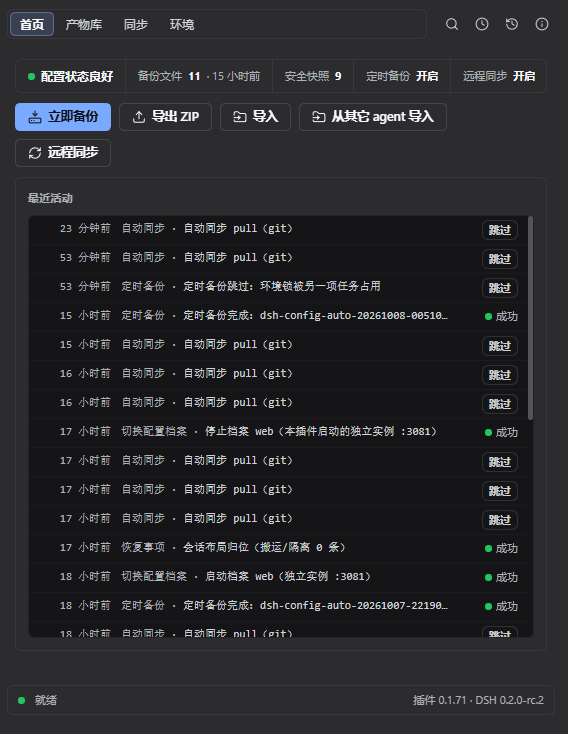
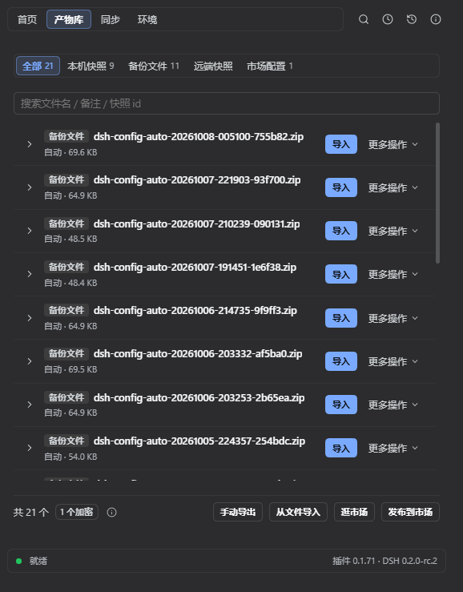
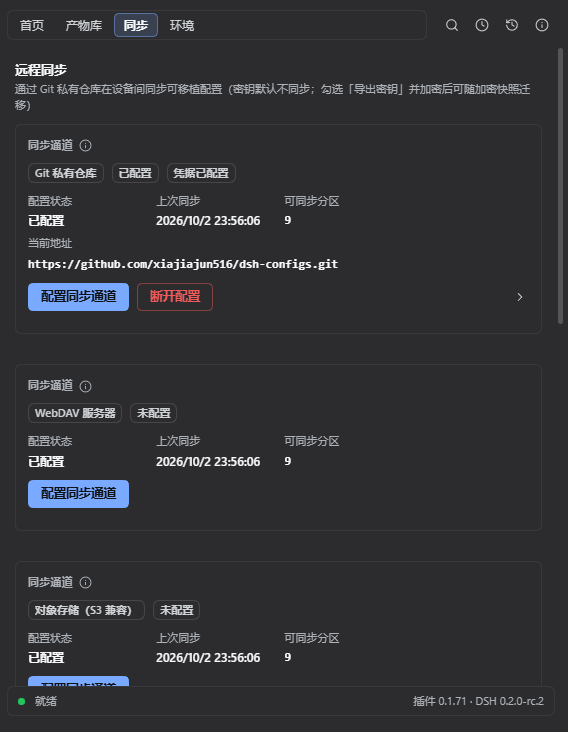
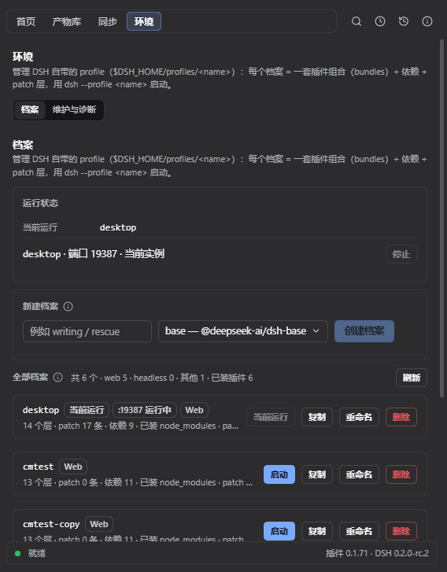

# 🎒 DSH Config Manager

[](https://www.npmjs.com/package/dsh-config-manager)
[](https://www.npmjs.com/package/dsh-config-manager)
[](https://github.com/xiajiajun516/dsh-config-manager/stargazers)
[](https://github.com/xiajiajun516/dsh-config-manager/blob/main/LICENSE)
[](https://github.com/deepseek-ai/deepseek-harness)

**DeepSeek Harness（DSH）配置备份、恢复与迁移插件。**

DSH Config Manager 是一个 DeepSeek Harness 配置备份与迁移插件：一键备份、恢复、导出、导入和迁移完整 DSH 配置，包括——

- DSH 设置
- 模型 / Provider 配置
- 已安装插件及插件配置
- MCP Servers
- Skills
- Agent Presets
- Workspace / AGENTS.md

> DSH 的 profile（`$DSH_HOME/profiles/<name>`）本身**不随备份迁移**（它是「用哪套插件组合启动」的机器本地选择）；
> 本插件的「档案」页可以列表 / 新建 / 重命名 / 删除它们，也可以**用某个档案另起一个独立实例并随时停止它**（真正可用的切换）。

把当前 DeepSeek Harness 环境导出为可移植备份，在另一台电脑上一键恢复；也支持通过 Git / WebDAV 跨机同步（密钥默认不同步，勾选「导出密钥」并加密后可随加密快照迁移）；还能通过内置**配置市场**浏览、一键安装社区分享的现成配置；并且能**从其它 AI Agent 导入**配置与历史会话（Claude Code / Cursor / Codex / Hermes / Antigravity 等 30 个来源）。

[English](README.md) · [简体中文](README.zh-CN.md)

---

## 这是什么？🤔

DSH 是你的 AI 助手工作台，里面存着你的各种设置：模型配置、插件、常用技能、工作区……

**DSH Config Manager 就是它的「搬家工具」**：

```
┌──────────────┐   ① 一键导出    ┌─────────────────┐   ② 一键导入    ┌──────────────┐
│   电脑 A      │ ─────────────► │  dsh-config.zip  │ ─────────────► │   电脑 B      │
│   我的配置     │                │   （一个文件）     │                │  配置全部恢复  │
└──────────────┘                └─────────────────┘                └──────────────┘
```

> ⚠️ **安全第一**：默认**不导出**任何密钥（API Key / Token / 密码）。详见 [安全](#-安全)。

---

## 🎯 典型使用场景

### 备份 DeepSeek Harness 配置

把你的 DSH 设置、模型供应商、插件、MCP 服务器、技能、Agent 预设与工作区打包成一个便携 ZIP 备份——默认不含任何密钥值（DSH 档案不随备份迁移，见上方说明）。

### 在另一台电脑上恢复 DeepSeek Harness

把当前 DSH 环境导出为一个 ZIP，在全新的 Windows / macOS / Linux 电脑上导入。一键恢复设置、插件、MCP 服务器、技能与全局指令（AGENTS.md）。

### 迁移 DSH 配置到新电脑

无需手动重装插件、MCP 服务器和技能，完整搬走你的 DSH 环境。失效的绝对路径会被自动检测并重新映射（支持批量前缀替换）。

### 在多台电脑间同步 DSH 配置

通过私有 Git 仓库、WebDAV、S3 兼容对象存储（AWS S3 / 阿里云 OSS / 腾讯 COS / MinIO / 七牛 Kodo）或 GitHub Gist 在多台电脑间保持可移植配置同步——密钥默认不参与同步（同步载荷会被 SecretScanner 剥离）；勾选「导出密钥」并设置加密密码后，`~/.dsh/.credentials.yaml` 会以 scrypt + AES-256-GCM 密文随加密快照上行，换机后可随同步写回本机凭据，远端（仓库 / WebDAV / 对象存储 / Gist）全程只见密文。

### 定时自动全量备份

在首页的「定时备份」卡里开启（6h / 12h / 24h / 7d，或自定义「每周固定星期与时刻」），DSH 会在后台按周期悄悄保留一份全新的全量配置备份——密钥永不包含，无需密码也能安心躺在磁盘上；保留多少份由同一张卡的「保留策略」（最近 N 份 + 每月 1 份 + 每年 1 份）决定，连续失败会在卡里标红。

### 从配置市场发现并安装共享配置

在内置官方市场浏览现成配置（模型 / Provider、插件、MCP、技能、Agent 预设……），先 dry-run 预览再一键安装——供应链警示恒展示，确认导入前每个分区都须显式批准。

### 从其它 AI Agent 导入（Claude Code / Cursor / Codex…）

你在这台机器上已经用过别的 AI 编程 Agent，配置和历史对话都在？选一个来源，本插件会把它**翻译成标准 bundle**（MCP、技能、全局指令、历史会话及其所属工作区），再交给同一条「先审后写」的导入流程：预览 → 逐项冲突决策 → 自动快照 → 应用 → 可回滚。共识别 **30 个来源**，其中 **29 个**可一并迁移**历史会话**。密钥**值**绝不读取，只记下名字供导入计划提示补录。

---

## 🆚 与其它备份 / 同步插件的区别

DSH 生态里这个方向有几个插件，它们解决的问题并不相同——按自己的场景选一个即可，也可以共存。

| 插件 | 最擅长 | 本插件更进一步的地方 |
|---|---|---|
| [xiaoyuyu6420/dsh-backup](https://github.com/xiaoyuyu6420/dsh-backup) | 一条命令从 CLI 给整个 `~/.dsh` 打快照，另有会话体检 / 升级快照 / 救援控制台 | 写盘前可审阅的 GUI 流程（dry-run 预览、冲突逐项决策、失败自动回滚）、跨机路径重映射、加密凭据载荷、配置市场 |
| [muyifc/dsh-config-sync](https://github.com/muyifc/dsh-config-sync) | 把 DSH 配置导出/导入成可移植的密码加密文件，可被工具调用 | 13–14 个分区（插件 / MCP / 技能 / 工作区 / 会话日志 …）、定时备份、四条同步通道（Git / WebDAV / 对象存储 / Gist）、会话跨机迁移与路径重定基 |
| [dickpy/dsh-cloud-sync](https://github.com/dickpy/dsh-cloud-sync) · [weibaohui/dsh-sync](https://github.com/weibaohui/dsh-sync) | 通过 WebDAV / S3 或私有 Git 镜像让多台机器保持一致 | 同步只是本插件五项能力之一——另有导出/导入、定时备份、配置市场与档案实例启停 |
| `cp -r ~/.dsh`（或给 home 目录挂 Git） | 免费、零配置，纯文本配置够用 | 不处理密钥、不做路径重映射、抓不到 `link:` / `file:` 安装的本地插件、不动会话日志、没有冲突处理与回滚 |

**一句话**：想要「一条命令把一切打快照」，`dsh-backup` 很好用；想要「把一整套能用的环境搬到另一台电脑、并持续同步，而且写盘前一定先给你看」，那就是本插件。

---

## ✨ 核心亮点

| 图标 | 功能 | 一句话说明 |
|:---:|---|---|
| 🚀 | **一键导出** | 打开导出流程，默认已勾好推荐分区，点一下打包成 ZIP（可逐分区 / 逐条目调整） |
| 📦 | **一键导入** | 在另一台电脑点一下，环境就回来了 |
| 👀 | **先预览再导入** | 先看「迁移前咨询」的结论与依据，再逐项选内容、逐项解决冲突，**绝不偷偷改你的配置** |
| ⚔️ | **冲突处理** | 遇到同名配置，让你自己选：保留当前 / 使用备份（可批量） |
| 🗺️ | **路径自动映射** | 换了电脑路径变了？自动检测并让你重新指定 |
| 🔒 | **密钥安全** | API Key 默认不导出；非加密导入后提醒重新填写，加密备份用密码解锁恢复 |
| ↩️ | **自动回滚** | 导入失败自动恢复原样，不会弄坏现有配置 |
| 📸 | **快照恢复** | 在产物库对某份导入前快照点「恢复」：先看逐行对照的恢复计划，确认后整文件还原 + 卸载新增插件（CLI 与 GUI 均支持） |
| 🔄 | **远程同步** | 通过 **Git 私有仓库 / WebDAV / S3 兼容对象存储 / GitHub Gist** 推送 / 拉取可移植配置，四条通道各配各的（密钥默认不参与同步；加密快照可选携带密文凭据） |
| ⏰ | **定时全量备份** | 按固定周期（6h / 12h / 24h / 7d 或自定义每周固定时刻）自动全量备份，一劳永逸，密钥永不包含 |
| 🛒 | **配置市场** | 浏览并一键安装社区分享的配置——供应链警示 + 逐项内容选择（可就地看到改动与高风险分区）；入口在产物库底栏「逛市场 / 发布到市场」或 ⌘K |
| 🗂️ | **档案 Profiles（DSH profile）** | 在「环境 → 档案」里直接管理 `$DSH_HOME/profiles/<name>`：列表 / 新建（官方模板）/ 重命名 / 物理删除 / **启动该档案（独立实例）** / **停止实例**（行内按钮按运行状态在「启动 ↔ 停止」间切换） |
| 🧩 | **本地插件随备份迁移** | `link:` / `file:` 安装的本地开发插件会被打包进备份，换机不再丢失 |
| 🗄️ | **保留策略可配（GFS 分层）** | 「最近 N 份 + 每月留 1 份 + 每年留 1 份」，默认值等价旧行为 |
| 🌐 | **双语界面** | 界面、报告与错误详情跟随 DSH 应用语言（中文 / English） |
| 🤖 | **Agent 工具** | Agent 会话内直接备份 / 快照 / 恢复 / 同步 |
| 💾 | **磁盘占用体检** | 「环境 → 维护与诊断」逐项列出本插件自身占了多少盘（备份 / 快照 / 同步副本 / 缓存 / 暂存），三档回收策略一目了然；**一键清理只碰可重建缓存与过期备份**，快照与同步数据永不在此删除 |
| ⬆️ | **版本更新检查** | 「关于」面板（导航右上角的图标）只读探测 npm 上的最新版本（缓存 10 分钟）；有新版本时既给可复制的升级命令，也提供一键**立即更新**（按该精确版本安装）——之后需重启 DSH 才生效，插件绝不代你重启；离线失败如实显示，不影响其它功能 |
| 🧭 | **兼容性讲清楚** | 导入前显示「来源 DSH 版本 / 平台 → 本机」，并用**结构化原因**解释评分（跨平台 / 分区缺失 / 版本超前…），而不是只丢一句「部分兼容」 |
| 🧳 | **从其它 AI Agent 导入** | 读取本机 Claude Code / Cursor / Codex / Hermes / Antigravity 等的配置**与历史会话**，翻译成标准 bundle，再走既有的预览 / 冲突 / 回滚流程导入 |

---

## 📸 功能截图

| 首页 | 产物库 |
|:---:|:---:|
|  |  |

| 同步（四条通道卡） | 环境 · 档案 |
|:---:|:---:|
|  |  |

---

## 🔄 它是怎么工作的？

### 导出（打包带走）

```
读取你的配置 → 剔除密钥（安全） → 生成清单 → 计算校验和 → 打包成 ZIP
```

### 导入（恢复环境）

每一步都先确认、先备份，**绝不直接改你的配置**：

```
选择 ZIP → 校验文件 → 检查完整性 → 检查版本 → 兼容性检查
    → 扫描内容 → 生成导入计划 → 迁移前咨询（结论 + 依据）
    → 选择要导入的内容 → 冲突逐项决策 → 路径映射 / 补录密钥
    → 确认导入 → 自动备份当前配置 → 执行导入 → 验证 → 完成
                      │
                      └─ 中途失败？→ 自动恢复原样（回滚，可在确认页关闭）
```

---

## 📥 安装

本插件是标准的 **DSH 插件**，安装只需要两步：

```bash
# ① 安装插件
dsh plugin --profile web add dsh-config-manager@latest

# ② 重启 DSH（设置页就会出现「备份与迁移」入口）
```

> 💡 照着复制就行：`@latest` 确保装到最新版。
>
> 🐛 **`@latest` 装到了旧版？** 这是 **pnpm 的 `minimumReleaseAge` 供应链发布年龄策略**（不是缓存）。这个门槛**按版本、在解析时**判定：发布不足阈值（约 30 天）的版本对 `@latest` 不可见，直到它「变老」——而**每个新版本都会重新计一次**。所以「装一次精确版本就永久正常」是错的：它只解决当时那一个版本，之后作者一发新版，`@latest` 又会装到旧版，**不是一次性修复**。
>
> **永久解决（推荐）**——只把这一个包排除在年龄门槛之外。在 profile 的 `pnpm-workspace.yaml`（`~/.dsh/profiles/web/pnpm-workspace.yaml`）里加上：
>
> ```yaml
> minimumReleaseAgeExclude:
>   - dsh-config-manager
> ```
>
> 之后 `@latest` 会一直解析到最新发布版，包括以后再发的新版本。
>
> **临时解决**——先问 npm「当前真正的最新版本是多少」，再按精确版本安装；每当有新版本发布都要重跑一次：
>
> ```powershell
> # Windows（PowerShell）
> $v = (npm view dsh-config-manager version).Trim(); dsh plugin --profile web add "dsh-config-manager@$v"
> ```
>
> ```bash
> # macOS / Linux
> dsh plugin --profile web add "dsh-config-manager@$(npm view dsh-config-manager version)"
> ```
>
> 重启 DSH 后，可在 **设置 → 备份与迁移 → 导航右上角的「关于」图标** 看到实际运行的版本（版本变化时也会自动弹出更新内容）。

### 从 GitHub 源码安装（`git+https://...`）

用 git 源安装时，pnpm 会先在该 clone 里跑本包的 `prepare` 脚本（= `npm run build`）把 `lib/` 构建出来 —— **产物在 npm 上已预构建，从 git 安装则是现构建**。pnpm 11 默认**拦截**这个脚本，直接报 `dsh: plugin command failed`，日志里是：

```
ERR_PNPM_GIT_DEP_PREPARE_NOT_ALLOWED  Failed to prepare git-hosted package ...
The git-hosted package "dsh-config-manager@x.y.z" needs to execute build scripts
but is not in the "allowBuilds" allowlist.
```

**解决**：把它提示的那一行（**含完整 git URL 与 commit sha**，逐字复制）加进 profile 的 `pnpm-workspace.yaml`：

```yaml
# ~/.dsh/profiles/web/pnpm-workspace.yaml
allowBuilds:
  dsh-config-manager@git+https://github.com/xiajiajun516/dsh-config-manager.git#<pnpm 打印的 sha>: true
```

> 键必须**逐字**照抄 pnpm 打印的那一行 —— 只写包名 `dsh-config-manager` 不生效（该白名单按「来源 + 版本」匹配）。
> 更省事的路径是直接装 npm 预构建版（上面的 `dsh-config-manager@latest`），无需任何白名单。
>
> - 或一行命令彻底关闭年龄门槛（在 profile 的 `pnpm-workspace.yaml` 顶部加 `minimumReleaseAge: 0`）：
>   ```powershell
>   $f = "$env:USERPROFILE\.dsh\profiles\web\pnpm-workspace.yaml"
>   $c = Get-Content $f -Raw
>   if ($c -notmatch '(?m)^minimumReleaseAge:') {
>     Set-Content -LiteralPath $f -Value ("minimumReleaseAge: 0`n" + $c) -Encoding utf8
>     Write-Output "已添加 minimumReleaseAge: 0"
>   } else {
>     Write-Output "已存在，无需修改"
>   }
>   ```
>
> 🐛 **安装被拒，但报错的版本你从没装过？** 症状：日志里 pnpm 明明写了 `+ dsh-config-manager ^0.1.66`，DSH 却报 `Plugin dsh-config-manager@0.1.44 is incompatible with dsh …` 并把安装回滚了。
>
> 原因既不在 pnpm 也不在版本解析：DSH 安装后还会做一次兼容校验，其中一步会读本插件 `cordis.patch.yml` 里的挂载行（`name: 'dsh-config-manager'`）并**再次解析这个包**，而 Node 的解析链会经过 `NODE_PATH`。若你的全局 npm 目录（`npm root -g`）里留着一份**同名旧版**（例如以前 `npm i -g dsh-config-manager` 装的 0.1.44），校验就会拿**那一份**的 `peerDependencies` 去比对 —— 于是报出一个 pnpm 根本没装的版本号。
>
> 确认与修复：
>
> ```powershell
> npm ls -g dsh-config-manager         # 有输出 = 全局确实存在一份
> npm i -g dsh-config-manager@latest   # 升到兼容版（或 npm uninstall -g dsh-config-manager 直接删掉）
> ```
>
> 之后重试安装即可。只要全局那份还在且与当前 DSH 不兼容，装哪个 profile（`web` / `desktop` / 自建）都会被同样拒绝。

---

## 🚀 快速上手（3 分钟体验）

> **界面速览**：一级只有 4 页 —— **首页**（这台机器现在怎么样 + 立即备份 / 导出 / 导入 / 远程同步四个动作）、**产物库**（本机快照 / 备份文件 / 远端快照 / 市场配置，所有「东西」都在这张列表里）、**同步**（Git / WebDAV / 对象存储 / Gist 四张通道卡）、**环境**（档案 / 维护与诊断）。**导出、导入、逛市场、发布到市场**是**流程面板**：从首页工具栏或产物库底栏打开，切到别的页就收起、切回来接着做。导航右上角四个图标分别是 ⌘K 命令面板、活动记录、迁移历史、关于。

```
电脑 A（导出）
  1. 打开 DSH → 设置 → 「备份与迁移」→ 首页
  2. 点工具栏「导出」→ 面板里默认已勾好推荐分区（要改就点「选择要导出的内容」逐分区 / 逐条目调整）
  3. 点「开始导出」→ 完成后自动下载得到 dsh-config-<日期>-<随机后缀>.zip（报告里可确认没有密钥）

把 ZIP 拷到电脑 B（导入）
  1. 打开 DSH → 「备份与迁移」→ 首页点「导入」（或产物库底栏「从文件导入」）
  2. 选择 ZIP → 等待分析 → 先读「迁移前咨询」的结论与依据 → 点「下一步：选择要导入的内容」
  3. 逐项勾选要导入的内容（不勾选的既不导入、也不进快照）
  4. 有路径问题？→ 在「路径映射」里填新路径（支持批量前缀映射）
  5. 有同名配置冲突？→ 逐项选「保留当前 / 使用备份」（可一键全选其一）
  6. 「确认导入」→ 等待执行（执行前自动创建安全快照；「失败时整体回滚」可在确认页关闭）
  7. 按提示补录缺失的 API Key
  8. ✅ 设置 / 插件 / MCP / 技能 / 工作区 / 全局指令（AGENTS.md）都回来了
```

---

## 🧩 功能详解

### 📤 导出（一个流程 + 内容选择器）

打开「导出」流程面板（首页工具栏「导出」，或产物库底栏「手动导出」），一屏完成：

| 区域 | 说明 |
|---|---|
| 选择要导出的内容 | 打开内容选择器：**分区 → 最小可拆单元**逐项勾选；默认已勾好推荐分区（可移植、非设备专属），随时可改 |
| 安全选项 | 「加密备份」（scrypt + AES-256-GCM）与「导出密钥」两个独立开关；勾选导出密钥会自动联动加密（密钥绝不明文） |
| 文件名与备注 | 自定义文件名与备注（备注让你在产物库里搜得到），非法字符由字段错误提示当场指出 |
| 本次将导出 | 恒常显示的构成卡：真正会进包的每个分区与条目数、合计大小；**读不到的分区如实显示「读取中 / 读取失败」，不伪报 0** |
| 结果 | 完成后**自动下载**到浏览器下载目录（报告里也可再下载）；报告逐条列出分区与告警 |

> 导出只读、不写任何配置。文件内含清单 + 各分区数据 + SHA-256 校验和，默认命名 `dsh-config-<日期>-<6 位随机>.zip`（撞名自动递进，不覆盖已有备份）。

**导出补充：**
- **导出前就能看**：构成卡在导出之前就给出会进包的分区与预估体积（不含密钥），不必先导出再翻报告
- **自定义文件名与备注**：文件名默认自动生成，也可自己起名；备注会显示在产物库的**「备份文件」**列表里（备注随 `self` 分区一起被备份 / 同步带走）

### 📥 导入（安全流程）

- **未确认不写入**：分析、预览阶段零修改
- **先备份再导入**：执行前自动备份将被修改的配置
- **失败自动回滚**：按你的选择整体回滚或跳过失败项继续
- **导入后的下一步清单**：结果页会列出需要重启 DSH 的项（按插件 / MCP）、待补录的凭据，以及可重试的失败 / 跳过项

### 👀 导入预览（Dry Run）

导入前完整展示：

```
✓ 18 项设置将被更新      ✓ 6 个插件已安装
⚠ 2 个插件需要安装       ⚠ 3 个密钥需要重新填写
⚠ 1 个路径需要映射        ⚠ 2 处冲突需要处理
```

### ⚔️ 冲突处理

目标电脑已有同名配置时，让你选：

| 选项 | 含义 |
|---|---|
| **保留当前** | 不动目标机现有的配置 |
| **使用备份** | 用备份里的配置覆盖 |

列表顶部还有「全部保留当前配置 / 全部使用备份配置」两个批量按钮。

> 说明：刻意**不提供**「稍后决定 / 再看看」选项——未决的冲突会让导入无法继续，每个冲突都必须在继续前做出选择。

### 🗺️ 路径映射

换了电脑，`C:\Users\alice\projects` 在另一台机器上不存在？插件会：
1. 自动检测失效的绝对路径
2. 让你选择新路径
3. 支持**批量前缀映射**（如 `C:\Users\alice\` → `/Users/bob/` 一键替换所有相关路径）

### 🧳 从其它 AI Agent 导入（配置 + 历史会话）

不必手工重建另一个 Agent 里已经调好的那套配置。

- **识别 30 个来源** —— Claude Code、Hermes、Cursor、Codex、Antigravity、Gemini、OpenCode、Mimocode、ZCode、Grok Build、OpenClaw、Pi、Kimi、Kilocode、Qoder、ChatGPT、WorkBuddy、Qwen、Continue、Cline、Goose、Zed、Crush、TeleAgent、Trae、Vibe、Reasonix、Copilot，以及 DSH 自己（从另一个 DSH home 导入，其 v3 / v4 日志算两个 id）。本机**没装**的来源照样列出来（置灰不可选）——「这台机器没有这个工具」不会被误解成「功能没做」。
- **是翻译，不是第二套导入通道** —— 来源被转成标准 bundle v1 ZIP，交给**既有**导入向导：同一份预览、同一套逐项冲突决策、同一次导入前快照与回滚、同样的 dry-run。
- **会带走什么** —— MCP Servers、技能、全局指令（落成 `AGENTS.md`），以及**历史会话连同这些对话所属的工作区**（29 个来源；会话会重新编码成 DSH 的会话日志格式，并按它记录的 `cwd` 归位）。
- **不会带走什么** —— 密钥**值**一律不读：只记录键名，由导入计划提示补录。DSH 没有对等结构的东西（Claude Code 的 hooks、斜杠命令等）会**报出明确的码**，不会静默丢掉。
- **如实跳过** —— 没记录 `cwd` 的对话无处归位，会列为跳过（绝不猜进别的项目）；已知的有损项在导入**之前**就摆明。
- **入口** —— 首页工具栏「导入」→ 面板里的**「从其它 agent 导入」**（首页另有直达入口）、⌘K 的「从其它 agent 导入」，或 CLI：`dcm import --from <来源> [--dry-run] [--out <路径>]`。

### 🔒 密钥处理

| 场景 | 行为 |
|---|---|
| 默认备份 | **不含任何密钥值**，只记录"哪些密钥需要填写" |
| 加密备份（可选，显式勾选） | scrypt + AES-256-GCM，每次导出随机 salt 与 IV；密钥绝不明文落盘，密码**绝不写入备份文件** |
| 加密备份导入 | 必须输入导出时的加密密码解锁：输入→验证密码→凭据自动恢复，**无密码无法导入** |
| 非加密导入后 | 提示「3 个密钥需要重新填写」，输入后仅保存在内存中写入 |

### 🔄 远程同步（四条通道）

「同步」页把每条通道列成一张卡，**四张恒显示**（未配置的是矮态，点卡里的按钮配置）——Git 私有仓库 / WebDAV 服务器 / 对象存储（S3 兼容：AWS S3、阿里云 OSS、腾讯 COS、MinIO、七牛 Kodo）/ GitHub Gist：

| 通道 | 端点（非密字段） | 凭据（只进 DSH credentials，绝不回读） |
|:---:|---|---|
| **Git 私有仓库** | `repoUrl`（可直接从当前 token 可见的**私有**仓库里选，或就地新建一个私有仓库） | 访问令牌 → `DSH_CONFIG_MANAGER_SYNC_TOKEN` |
| **WebDAV** | `webdav.url` | `username` 存配置、可在界面回显；**密码永不同步、永不记日志** → `DSH_CONFIG_MANAGER_SYNC_WEBDAV_PASSWORD` |
| **对象存储（S3 兼容）** | 端点 / region / bucket / 对象键前缀 / AccessKey ID（标识符，可回显） | AccessKey Secret → 该通道自己的凭据槽位（同步文件里只留「已配置」标记） |
| **GitHub Gist** | gist id / API 根 / 文件名前缀 | Gist token → 该通道自己的凭据槽位 |

- **每条通道各配各的**：同步分区、自动同步（开关 + 兜底轮询间隔）、加密与「导出密钥」、远端快照、加密 / 解密密码都**按通道独立**，在它自己那张卡内配置（已配置的卡可折叠，免得 4 张全展开撑爆画布）。
- **远端保留跟本地同一套策略**：按你的备份计划保留——默认最新 **10** 个快照，可另设「每月 1 份 / 每年 1 份」分层；刚推上去的那份恒保留，更旧的自动删除。
- **切换通道重新开始**：各通道的远端快照 / 共同祖先**互不共享**。换一条通道（或断开重配）就是从新远端的空基线重新开始——请先推送一个新快照。
- **WebDAV 认证**采用 HTTP Basic：`username` 存配置、可在界面回显；`password` 则实时从 DSH credentials 槽位 `DSH_CONFIG_MANAGER_SYNC_WEBDAV_PASSWORD` 读取——绝不出现于任何同步文件或日志。
- **插件自动安装**：拉取差异时，备份里新增的插件会在确认导入时**自动安装**，无需在差异列表里逐项手动勾选；只有**版本冲突**的插件仍需要你决定「保留当前 / 使用备份」。
- **推送前先预览**：「推送」按钮先给出只读预览（分区 + 各分区条目数 + 相对基线的改动标记；没有基线时提示这是首个基线），确认后才真正写远端。
- **密钥默认不同步**：同步载荷逐分区过 `SecretScanner`（敏感字段值剥离），凭据分区结构性排除。勾选「导出密钥」并设置加密密码后，`~/.dsh/.credentials.yaml` 以 scrypt + AES-256-GCM 密文作为**独立凭据载荷**随加密快照上行（不放进任何分区）；拉取侧解密后生成逐条「凭据迁移」项，你确认采纳才写回本机凭据（`credentials.set`）。加密/解密密码保存在本机 DSH 凭据库（`~/.dsh/.credentials.yaml` 的独立槽位）：勾选「加密备份」后自动记住（输入框留空即沿用），取消勾选或点「删除已保存密码」即清除 —— 密码绝不写入同步文件、响应、日志或导出备份，也绝不回传浏览器；解密密码只在拉取的快照确实加密时才会被使用。**自动同步恒不含凭据**（无密码可用，遇到加密快照会跳过）。

### 🛒 配置市场（Marketplace）

浏览并一键安装社区分享的现成配置（模型 / Provider、插件、MCP、技能、Agent 预设……）。入口在**产物库底栏的「逛市场 / 发布到市场」**（也可用 ⌘K）——它是**流程面板**，不是一级页面：

- **内置官方市场**——只读、绑定官方公开仓库（官方徽章，不可编辑）；首次打开自动刷新，也支持手动拉取最新
- **搜索与筛选**——关键词搜索（匹配名称 / 描述 / 作者 / **分类**）、类别过滤、**分区筛选**（已下载过的条目会列出自己的分区，其余条目标注提示后排除）、来源筛选（官方 / 个人）、排序（最近更新 / ⭐ 最多 / 名称 A–Z），并显示**来源仓库**的 ⭐ star 数（匿名查询，不触碰任何 token）
- **影响预览**——详情页在确认之前就列出「装它会改什么」（更新项 / 一致项 / 冲突项 / 待补录密钥 / 需要重启 DSH）
- **供应链警示恒展示**——来源仓库 URL +「未经官方审核」+ 下载时间；**逐项内容选择**——选择页列出每个单元「本次将改动什么」并就地标出高风险分区（默认勾选，取消勾选即不导入、也不进快照）；历史会话 / 任意文件类高风险内容仍直接禁止上架
- **安装复用安全导入管道**——分析 → 预览 → 自动备份 → 执行 → 回滚；确认前零写入
- **「我的配置」**——GitHub 登录（device flow）后一键上传到**你自己的公开仓库**，并自动向官方市场仓库提交**收录 PR**；管理已上传条目（收录状态徽章：未收录 / PR 待审核 / 已收录）、一键更新、装回本地、删除（自动下架 PR）

### 🗂️ 档案（Profiles = DSH 自带 profile）

「档案」就是 DSH 自己的 profile（`$DSH_HOME/profiles/<name>`）——一套**插件组合（bundles）+ 依赖 + patch 层**，
用 `dsh --profile <name>` 启动。「环境 → 档案」直接读写这个目录，不再自建一套「配置快照」：

| 动作 | 说明 |
|---|---|
| 列表 / 详情 | bundles 层、依赖、patch 条目与体积、patchReload、node_modules、更新时间；详情可看 `package.json` 与 `cordis.patch.yml` 原文（展示前脱敏） |
| 新建 | 在 `$DSH_HOME/profiles/<name>` 写标准三件套（与官方 `initProfile` 等价）；可选起步模板 base / web / headless / sdk / sdk-minimal / acp |
| 重命名 | 目录级移动 + 同步修正 `package.json` 的 name；当前运行中的档案拒绝重命名 |
| 删除 | **物理删除整个目录**（含 node_modules）；当前运行中的档案需额外勾选确认 |
| 启动该档案 | **真正可用的切换**：以该档案另起一个**独立 DSH 实例**（自动挑空闲端口 + 自动打开浏览器），当前实例与正在跑的任务不受影响；只支持 **web 形态**档案：非 web 形态（如 base 模板）没有浏览器界面，点击后给出终端命令而不是静默失败 |
| 停止实例 | 该档案有实例在跑时，行内「启动」自动变成「停止」（运行状态卡里也有一个）；先请它自己退出（优雅期），超时才结束进程树，并如实告诉你是哪种；**实例运行中拒绝物理删除该档案** |
| 不会重复启动 | 「哪些档案在跑」= 本插件启动的实例台账 ∪ **每个实例自报的心跳**（`<dataDir>/running/<profile>.json`，只含 pid/端口，**不含认证 token**）→ 哪怕某个档案是你手动 `dsh web` 起来的，「档案」子视图也不会再启动第二个同名实例（明确提示已在运行）；**当前这个实例本身**不给停止按钮（停自己会把你自己杀掉——请关窗口/终端，或到启动它的那个实例里停止） |

> **为什么没有「设为下次启动」**（2026-09 该按钮与标记一并移除）：DSH **没有「默认 / 下次启动 profile」这种状态** ——
> profile 只由启动参数决定（`dsh <名>` / `--profile <名>`，`dsh web` 是硬编码别名），任何「下次启动用哪个」的标记
> **都没有消费者**：你自己敲的 `dsh web` 重启后当然还是 web。真正可用的切换只有两种：① 「环境 → 档案」里的「启动该档案」
> 另起一个实例（不打断当前会话，随时可停）；② 把启动命令/快捷方式换成 `dsh --profile <名>`
> （生态里的 dshm、DSH Launcher 也都是「外部启动器 spawn 实例」这一条路）。
> 本插件启动的实例记在 `<dataDir>/launches.json`（pid/端口/日志），所以**关得掉**；
> 第三方插件需要在该档案里单独安装（`dsh plugin --profile <name> add <pkg>`）。

### 📸 快照恢复（撤销一次导入）

每次导入都会先创建**安全快照**。导入后如果觉得哪里不对劲，可以把目标环境恢复到导入前的状态：

| 动作 | 说明 |
|---|---|
| 整文件还原 | settings.yaml / settings.json / cordis.patch.yml 的 blob 写回 `$DSH_HOME`；快照时不存在、导入后新增的文件会被移除 |
| 插件卸载 | 导入期间新增的插件经官方 `dsh plugin remove` 卸载（与基线对比；旧快照无基线时只给提示） |
| 文件补偿 | skills / agentPresets / agentInstructions / pluginFiles / sessions 的 blob 写回原路径 |
| 凭据 | DSH 不回读凭据值——只提示人工重新填写 |

**GUI**：产物库 → 源筛选切到**「本机快照」**→ 行内 ⋯ → **「恢复」**→ 先看恢复计划（dry-run，零写入；git 风格的逐行对照）→ 确认执行。行内还有「查看与对比 / 迁移前咨询 / 置顶 / 删除」等能力，按该行是什么产物给。

**快照管理**：

- **保留份数可见**：保留多少份由你的**保留策略**决定（首页「定时备份」卡；默认保留最新 **10** 份），列表里有提示
- **置顶重要快照**：置顶的快照豁免自动清理，只能手动删除
- **手动删除**：不再需要这个回滚点时可直接删除（危险操作，有二次确认）

**备份文件**（产物库 → **「备份文件」**来源）：

- 列出 `exports/` 里每一份导出 ZIP（手动导出 + 定时备份），带来源徽章、体积、时间与你写的**备注**
- 按文件名或备注**搜索**
- **查看与对比**：导入前先只读预览它包含什么（分区 + 各分区条目数）以及与当前配置的差异（零写入）
- 下载、直接导入恢复、删除

**磁盘占用**：在**环境 → 维护与诊断**的**「磁盘占用」卡**里，逐项列出本插件自己占用的空间
（导出备份 / 导入前快照 / 同步配置与工作副本 / 市场缓存 / 临时暂存 / 日志 / 事务日志 …），
标注每项的回收策略：**可随时重建**（缓存与暂存）、**有保留期**（导出产物 7 天、定时备份保留最近 N 个）、
**用户数据 / 安全网**（快照与同步，永不自动清理）。需要腾空间时点**「立即清理」**：
默认只清可重建的缓存与暂存；要回收过期备份文件需显式勾选「同时回收过期备份文件」（并二次确认）。
**快照与同步数据永远不会被这个按钮删掉**；目录读不到时如实显示「未统计」，不会伪报 0 字节。

---

### 🚨 CLI —— DSH 挂了时的第一救急手段

GUI 住在 DSH *里面* —— DSH 起不来时，GUI 也帮不了你。而 `dsh-config-manager` 的 **CLI 完全独立于 DSH 运行时**（纯 Node + 核心引擎，**绝不 import `@deepseek-ai/*`** —— 即使 DSH 的 peer 包损坏或缺失也照常运行）。因此它是你在**配置损坏、GUI 无法启动、或换新机器要还原环境**时的**第一救急工具**。

它是一个独立的 npm 命令行工具，**需单独安装**（与插件安装是两回事）。在任意可能需要救急的机器上装一次即可：

```bash
# --omit=peer：离线 CLI 只需要 js-yaml，不需要 DSH 的 peer 依赖包
npm install -g dsh-config-manager@latest --omit=peer
```

> ⚠️ 只安装/更新插件（`dsh plugin --profile web add ...`）只启用 GUI，**不会**产生 `dsh-config-manager` 命令。请先执行上面这条安装命令，然后使用下面任意命令。

全部命令（`dsh-config-manager help` 也会按风险分组列出；`dsh-config-manager <命令> --help` 打印该命令的参数、退出码与示例）：

```text
# 离线救急台（本机网页，最省打字）
dsh-config-manager web [--port <n>] [--no-open] [--home <dir>]
                       [--data-root <dir>] [--idle-timeout <min>]

# 只读检查（绝不改你的配置）
dsh-config-manager snapshots [--data-dir <dir>]                # 列出快照（最新在前）
dsh-config-manager verify [<文件|路径>] [--json]                 # 只读自检备份 ZIP
                           [--data-dir <dir>]
dsh-config-manager sessions list   [--home <dir>] [--json]     # 列出本机会话
dsh-config-manager sessions doctor [--home <dir>] [--json]     # 会话体检 + 建议

# 备份与迁移（只写新文件）
dsh-config-manager backup [--sections <a,b,c>] [--out <path>]  # 离线文件级备份
                          [--dry-run] [--data-dir <dir>]
dsh-config-manager import --from <来源> [--dry-run]              # 外部 agent 配置 → bundle ZIP
                           [--out <路径>] [--cwd <dir>] [--data-dir <dir>]

# 修复（会写本机 —— 先用 --dry-run 预览）
dsh-config-manager restore [--id <id>] [--dry-run]             # 回滚到某份导入前快照
                           [--data-dir <dir>] [--data-root <dir>]
                           [--profile <name>] [--settings <path>]
dsh-config-manager sessions repair [--home <dir>] [--fix]      # 离线会话布局归位
                                   [--keep <dir>] [--map old=new]...
dsh-config-manager recover-stale-lock [--data-dir <dir>]       # 回收残留锁（见下）

# 危险（改 DSH 安装本体 / 可能清数据）
dsh-config-manager reinstall [--version <v>] [--yes] [--list]
                             [--wipe-config] [--dry-run] [--data-root <dir>]

# 帮助
dsh-config-manager help [command]                              # 总览 / 单条命令详情
```

**`reinstall` —— DSH 损坏时的救急重装。** 跨平台一键重装 `@deepseek-ai/dsh` 启动器（按操作系统自动选用正确命令：Windows 走 PowerShell、Unix 走 bash）。默认重装启动器 + 清全局残留缓存；交互式多选会询问是否勾选**危险**清理项（设置 / 插件 / 会话与凭据）——这些**默认不勾选**，且只要涉及删数据的动作，执行前都必须**二次确认输入 `YES`**。清空 `~/.dsh` 数据前会先做一份 `.reinstall-backup` 紧急备份（`snapshots/` 目录按设计绝不触碰）。

```bash
# 查看可选清理项
dsh-config-manager reinstall --list

# 交互式：选择清理项 → 确认 → 重装 DSH
dsh-config-manager reinstall

# 非交互：全部勾选并跳过确认
dsh-config-manager reinstall --yes

# 连配置数据一起清（等价于勾选全部数据项）——仍会要求交互确认
dsh-config-manager reinstall --wipe-config

# 只预览执行计划，不真正运行
dsh-config-manager reinstall --dry-run
```

**快照恢复。** 列出并恢复安全快照（恢复引擎内置于 CLI，无论 DSH 能否启动都能用）：

```bash
dsh-config-manager snapshots                                  # 列出快照（最新在前）
dsh-config-manager restore --dry-run                          # 预览恢复计划（零写入）
dsh-config-manager restore --id <snapshot-id>                 # 执行恢复（先备份当前文件）
```

每次覆盖/删除前都会先把当前文件复制到 `<snapshotDir>/pre-restore/`，可人工反悔。任一动作失败则退出码为 1；报告如实列出 已还原 / 已卸载插件 / 需人工处理 / 失败 / 跳过。

**`verify` —— 三个月前那个备份现在还能不能用？** GUI 长在 DSH 里，DSH 起不来时它答不了这个问题，`verify` 能。它把备份 ZIP 从磁盘重读一遍，**一个字节都不写**，然后逐文件给出裁决：

| 裁决 | 含义 |
|---|---|
| `OK` | 结构合法，且每个条目都与 `integrity/checksums.json` 里的 SHA-256 一致 |
| `MISSING` | 文件不在（路径写错 / 已被删除） |
| `CORRUPT` | 损坏或被篡改——报错会**点名具体是哪个条目** |
| `UNSUPPORTED` | 备份本身有效，但本版本插件读不了（schema 过新，或整体加密容器需先解密） |
| `VERIFY_ERROR` | 自检自身失败（磁盘 IO）；绝不降级成猜测结论 |

不给参数就校验导出目录下**全部** `*.zip`；给文件名或路径就只校验那一个。**只要有一个不是 `OK` 退出码就是 `1`**，因此可直接在 CI / 定时任务里断言。`--json` 输出同样的机器可读结果。

```bash
dsh-config-manager verify                # 校验导出目录下的全部备份
dsh-config-manager verify --json         # 机器可读（退出码语义不变）
dsh-config-manager verify my-backup.zip  # 按文件名只校验一个
dsh-config-manager verify C:/backups/dsh-config.zip   # 或按路径
```

**`backup` —— DSH 挂了也能备份。** 它是 GUI 导出的离线版：把 `$DSH_HOME` 里**无需 DSH 运行时即可直读**的部分（skills、agent presets、agent instructions、插件自身配置）打成与 GUI 导出同结构的 ZIP（`manifest.json` + `integrity/checksums.json` + 分区目录），落盘后立即用与 `verify` 同一引擎对自己做一次自检——一个从不校验自己产物的备份命令，比没有更糟。

**凭据文件永不进入备份。** `.credentials.*`、`.env`、`*.pem` 等由显式黑名单排除；只遍历白名单目录（绝不对整个主目录递归）；symlink 一律跳过而非跟随。

**离线备份只覆盖磁盘上的技能。** 插件注册表里的技能（外壳从 profile 的插件包里加载的那些，见 issue #71）需要 DSH 运行时才能列举，因此**只有 GUI 导出（或 DSH 健康时的定时备份）能带上它们**；CLI `backup` 只收 `$DSH_HOME/skills` 目录下的文件——想要完整的技能备份，请在 DSH 健康时用 GUI 导出。

结构化分区（设置 / UI / providers / 插件 / MCP / prompts / workspaces）**不会**被偷偷伪造：它们需要 DSH 服务层读值并脱敏，因此一律不写入、在 manifest 里标记为 `false`——计划输出会把它们列在「离线不可收集」下，让你清楚这份备份到底有什么、没有什么。DSH 健康时想要完整备份，请用 GUI 导出。

```bash
dsh-config-manager backup --dry-run                       # 列出将打包哪些文件（零写入）
dsh-config-manager backup                                 # 写入导出目录，随后自动自检
dsh-config-manager backup --out D:/rescue/config.zip      # 指定输出（绝不覆盖既有文件）
dsh-config-manager backup --sections skills,self          # 收窄范围
```

`--sections` 可选值为 `skills,agentPresets,agentInstructions,self,pluginFiles`。其中 `pluginFiles` 与 GUI 侧一致属**默认关闭**：它原样复制第三方插件自有文件，而 `dsh-ssh.json` 里是明文主机密码——确认过内容之后再选它。


**典型救急流程**（DSH 起不来时）：① `dsh-config-manager reinstall` 先把启动器重装回来（必要时顺带清理），② 若 DSH 报会话日志错误（`corrupt session log` / `duplicate JSONL session id`），先跑 `dsh-config-manager sessions repair --fix` 把日志目录离线归位，③ `dsh web` 重新启动 DSH，④ 从仓库装回插件，⑤ 从远程仓库拉取快照（或执行 `dsh-config-manager restore`）把配置恢复回来。整个流程中 CLI 全程可用，与 DSH 是否健康无关。

**`recover-stale-lock` —— 每次操作都突然失败时用这个。** 动你的配置之前，插件会先占一把小的环境锁（记录谁在操作 + 心跳），让两个操作永远不可能同时写配置。如果某个 `dsh web` 进程被**强杀**（任务管理器 / `kill -9`），锁文件会带着一个已经死掉的持有者留在盘上：下一次操作被拒，而且**重试多少次、重启 DSH 都没用** —— 因为插件刻意从不自行删锁（猜错就会把正在进行的操作踢掉）。

症状与修法：

| 症状 | 含义 | 修法 |
|---|---|---|
| 「另一个任务正在运行，请稍后重试。」 | 有活着的操作持锁 | 等一会儿，它会自己清 |
| 「检测到上次异常退出残留的配置锁…重试或重启 DSH 均无效」（日志里是 `自动同步已跳过`） | 持有者进程**已被证明死亡**（残留锁） | 跑下面这条命令，或用 GUI **事故恢复 → 回收残留锁** |
| 同一句提示，但持有者 PID 被一个无关进程**复用**了（Windows 常见） | 心跳已陈旧很久，锁仍被判成残留 | 同样的修法 —— 心跳陈旧时间远超阈值后即可回收 |

```bash
# 安全：先检查，证明持有者已死才回收（活着的锁绝不碰）
dsh-config-manager recover-stale-lock
```

**`sessions repair` —— DSH 因为会话日志起不来时用这个。** DSH 校验每条会话日志必须正好待在自己 header 声明的目录里：`corrupt session log … header id and cwd identify …`，或 `duplicate JSONL session id … in multiple project directories`。这时插件帮不上忙（它只在 DSH *内部*加载），而这是唯一能在 DSH 停着时工作的修复路径。它读每条会话首帧的 cwd，把会话目录搬到 `projectKeyOf(cwd)` —— 位置从日志本身推导，绝不猜。

- **默认 dry run**（零写入）；`--fix` 才真的搬。退出码：dry run 恒 0，`--fix` 有任何失败 / 冲突 / 回滚则 1。
- **`--map old=new`**（可重复）用于跨机恢复：前缀命中时先改写首帧 cwd 再搬目录（其余帧逐字节拷贝）。目标已存在时绝不覆盖。
- **`--keep <dir>`** 解决重复 id：你点名的副本保留，其余移入 `sessions/.cm-repair-quarantine-<时间戳>/` —— 只移动、绝不删除。不给 `--keep` 时只报告重复、不动。

```bash
# 先看会搬什么（完全不写盘）
dsh-config-manager sessions repair
# 执行，并把源机前缀映射到本机
dsh-config-manager sessions repair --fix --map 'C:/Users/alice=D:/Work'
```

两台机器的 **DSH 基础路径不同**时（如 `/opt/dsh/.dsh` 对 Windows 盘符路径），备份里记着源机基础路径，导入会**自动重定基**：把它下面所有路径（会话 cwd、工作区路径…）落到你本机的路径上 —— 不用手填映射。用户映射仍在其后生效，可覆盖任何一条。

在内容选择器里，勾选会话会连带勾选拥有它们的工作区（取消勾选工作区也会取消它的会话）。

跨机恢复在 GUI 里不需要额外步骤：**导出会话现在会连带带上拥有它们的工作区**，导入向导里填的路径映射会同时改写工作区路径与会话首帧 cwd（并相应搬目录），然后才把这些会话登记到那些工作区上。

**插件装好了但备份看不到？** 检查 **设置 → 备份与迁移 → 导航右上角的「关于」图标**：它会显示插件清单是从哪个目录 / profile 读的、识别到几个插件。清单来自 `$DSH_HOME/profiles/<profile>/package.json` → `dependencies`（外加 `dsh.profile.bundles` 里声明、但不是依赖的项），`<profile>` 按 `config.profile` → `--profile` → `web` 解析。如果显示的路径不是你装插件的那个 profile（桌面端可能用别的 profile 或别的 `DSH_HOME`），那就是原因 —— 把 `--profile` / `DSH_HOME` 对齐即可。

**`web` —— 离线救急台（不想在终端里敲命令时用这个）。** 它在本机起一个**只绑 127.0.0.1** 的小网页，
把上面的诊断信息与救急动作都摊在浏览器里：

```bash
dsh-config-manager web            # 启动并自动打开浏览器（终端里会打印带一次性 token 的链接）
```

- **只读部分**：实例心跳 / SAFE MODE / 残留锁 / 快照 / 导出产物（可一键自检）/ 磁盘占用 / 会话体检 / 档案与实例状态。
- **写动作（每个都要在网页里显式确认，且都调用与命令行同一套实现）**：① 会话布局归位 ② 清理可重建缓存与过期导出产物
③ 回收残留环境锁 ④ 启动 / 停止某个档案的独立实例 ⑤ **解锁加密备份**（只在内存里解密、只列条目，绝不写盘）
⑥ **恢复快照**（先看逐条计划，零写入；恢复前先把当前文件复制到 `<snapshot>/pre-restore/`）⑦ **离线导出**（文件类分区，落盘后立即自检）
⑧ **重装 DSH**（卸载 + 重装全局 CLI，**要求输入只打印在终端里的 6 位校验码**）。结果页逐条如实回执。
- **安全**：只绑回环地址；启动时生成一次性 token（只打印在终端），换成一个 HttpOnly + SameSite=Strict 的
会话 cookie，用过即废；页面零脚本、零外链。`Ctrl+C` 或空闲超时（缺省 30 分钟）即退出。
- **门槛**：会话归位与恢复快照需要 DSH 已停止；有 SAFE MODE 未结案或残留环境锁时写动作一律被拒（页面会写明原因）。
  **导入**（把 bundle 写回本机）留在 GUI/CLI —— 结构化分区需要 DSH 服务层在线。

### 🌐 走代理？(GitHub 登录 / 同步)

Node 内置的 `fetch()` 默认**不读** `HTTP_PROXY` / `HTTPS_PROXY`，所以在「GitHub 只能经本地代理访问」的网络里，「用 GitHub 登录」以前会直接失败：`请求 GitHub 设备码失败：fetch failed` —— 哪怕你的浏览器和 `git` 都正常。

**现在插件会把自己的出站请求自动走你的代理** —— 只要保证代理环境变量对 DSH 进程可见：

```bash
# macOS / Linux —— 启动 dsh 之前
export HTTPS_PROXY=http://127.0.0.1:7897
export NO_PROXY=localhost,127.0.0.1
dsh web
```

```powershell
# Windows PowerShell
$env:HTTPS_PROXY='http://127.0.0.1:7897'; dsh web
```

行为细节：

- **覆盖插件全部出站**：GitHub API + device flow 登录（`fetch`）与 WebDAV 同步（原生 `http`/`https`），`https` 目标含 `CONNECT` 隧道；
- **没配代理就零影响** —— 没有代理变量时行为一字不变；
- **尊重 `NO_PROXY`**（`*`、精确主机、`example.com` 后缀、可选 `:port`）；
- **`DSH_CONFIG_MANAGER_PROXY=off`** 强制直连（即使有代理变量）；
- URL 里的代理凭据只用于 `Proxy-Authorization`，且**绝不记日志**；启动日志会打印一份脱敏的代理摘要，便于确认路由是否生效；
- 这是**插件私有**行为：绝不改全局 / 进程级网络设置（不同于 `NODE_USE_ENV_PROXY`，那会影响整个宿主进程，包括模型 API 调用）。

替代方案（宿主级）：在启动 DSH **之前**设 `NODE_USE_ENV_PROXY=1`（Node 24+）；注意这会把宿主自己的出站流量也一起走代理，不只是本插件。

### 🤖 Agent 可调用的模型工具

插件还向宿主注册了 **5 个模型工具**，让 AI agent（DSH 助手会话）能在对话中直接驱动配置运维——与 GUI 共用同一套备份 / 快照 / 同步引擎，无需打开界面：

| 工具 | 作用 |
|---|---|
| `config_backup` | 全量备份 DSH 配置到本地 `exports` 目录（**默认不含 secret**；传 `password` 可加密导出）。返回 ZIP 文件名 / 大小 / 分区清单 / 加密状态 |
| `config_list_snapshots` | 列出本地回滚快照（id / 创建时间 / 来源 / 状态 / 条目数），供 `config_restore` 使用 |
| `config_restore` | 恢复到指定快照。**默认只返回动作计划（零写入）**；传 `confirm: true` 才真实执行（会覆盖 / 删除 `$DSH_HOME` 文件并卸载导入期间新增插件——破坏性操作，务必先预览） |
| `config_sync_push` | 手动推送配置同步到远端（Git / WebDAV），复用已持久化的通道配置。写远端属主动操作；加密 / 含凭据必须传 `password` 且引擎强制 `encrypt` |
| `config_sync_pull` | 拉取远端差异**预览**（零写入：只下载 + 分析出差异报告）。要落地差异需另走确认导入管道 |

安装插件后，这 5 个工具会自动出现在任意 agent 会话的工具清单里（宿主未组合 agent `tools` 服务时静默跳过注册）。由 agent 在任务相关时自主调用，例如「备份我的配置」「看看有哪些快照」「恢复到那个快照」「同步到我的仓库」「给我看远端差异」。安全不变量内建：`config_restore` 默认 dry-run、`config_sync_pull` 永不写入、`config_sync_push` 是显式远端写操作，且 secret 值永不进入工具入参 / 出参 / 日志。

---

## 🛡️ 安全

- **默认备份不包含任何密钥值** —— 这是硬性规则，导出时强制执行
- **默认不导出**：API Key / 密码 / Token / Cookie / 会话 / 设备唯一 ID / 日志缓存 / 插件二进制
- **ZIP 是"不可信输入"**：防御 Zip Slip、恶意路径、压缩炸弹、损坏文件——任何一项触发就整体拒绝
- **日志全程脱敏**：密钥值永不进入日志
- **加密备份（显式选择）**：密钥仅以 scrypt + AES-256-GCM 密文导出——每次导出随机 salt 与 IV，绝不明文；密码只在内存中，绝不写入文件

---

## 🤝 兼容性

| 状态 | 含义 |
|---|---|
| ✅ Excellent | 同平台、配置齐全、版本兼容 |
| 👍 Good | 备份来自更旧版本的 DSH |
| ⚠️ Partial | 跨平台 / 部分配置缺失 / 备份比当前新 |
| ❌ Unsupported | 备份版本超出支持范围（无法导入） |

---

## ❓ 常见问题

**Q：备份会包含我的 API Key 吗？**
默认不会。默认备份**绝不包含任何密钥**，只记录哪些密钥需要重新填写。若你显式选择**加密备份**，密钥才会包含在内，但仅以 scrypt + AES-256-GCM 密文存在（每次导出随机 salt 与 IV）——绝不明文。

**Q：导入会不会覆盖我现有的配置？**
不会偷偷覆盖。有冲突时让你逐项选择：保留当前 / 使用备份（可批量）；导入前还会自动创建安全快照，失败可回滚。

**Q：换电脑（Windows → macOS）能用吗？**
能。插件会自动检测失效的绝对路径，让你重新映射（支持批量替换）。

**Q：导出的 ZIP 被改坏了还能导入吗？**
不能。校验和检查不通过会直接拒绝导入（防止损坏或篡改）。

**Q：重复导入会重复吗？**
不会。按插件 ID / MCP 名称 / 技能名等稳定标识配对：完全一致的跳过，与目标机有差异的会列为**冲突由你决定**（保留当前 / 使用备份），不会静默覆盖。

**Q：加密备份导入时需要密码吗？**
需要。导入向导会要求输入导出时设置的加密密码并验证通过后才能继续执行；密码仅存于内存、绝不保存。密码错误或缺失都会阻止导入（密码正确时凭据直接从备份解密恢复，无需重新填写）。

**Q：`dsh web` 启动后控制台为什么安静了？想恢复日志怎么办？**
这是刻意的。常规进度日志（挂载横幅、调度器跳过、导出/备份完成）是 `info` 级别，而插件出厂默认级别为 `warn`——所以控制台只剩警告与错误。启动 DSH 前设 `DSH_CONFIG_MANAGER_LOG_LEVEL=info`（或 `debug`）即可恢复逐条输出。

---

## 📋 已知限制（用户须知）

1. **安装/更新插件或 MCP 后需重启 DSH 才生效**
2. **部分界面状态不迁移**（如任务看板数据、面板宽度——它们存在浏览器里，不在 DSH 配置文件内）
3. **keybindings / workflows 配置 / commands**：DSH 当前没有这些概念，因此不会导出相关内容。全局 agent 规则已由**全局指令（Agent Instructions）**承接（`~/.dsh/AGENTS.md`，注入每个会话）；项目级 `AGENTS.md` / `CLAUDE.md` 属于各项目仓库本身，不在个人配置迁移范围内
4. **历史会话是显式可选项** —— DSH 自己的会话只有在导出 / 同步时**显式勾选 `sessions` 分区**才会带走（同步通道还要求两侧都放行）；**其它 Agent 的历史会话在你选中那个来源时迁移**。DSH 会话格式里没有位置的对话状态（模型思考过程、图片、压缩检查点）一律**如实计数并报告**，绝不伪造
5. **加密备份**：密码丢失则无法解密（设计使然——请牢记密码）
6. **快照恢复是离线的、诚实的**：离线引擎无法恢复的条目（快照无整文件备份时的 settings namespace / patch 行、存在 DSH storages 里的 workspace 记录）会如实列为跳过并指向在线回滚；凭据**值**绝不自动改写（只提示人工补录）；无插件基线的旧快照只提示人工核对新增插件
7. **从其它 Agent 导入有两处已知空白**：**Copilot 不支持导入历史会话**（其会话格式在本机无法取证，只导入它的配置）；Cursor 的项目历史要靠它自己的目录 slug 反解，个别项目可能对不上。用**旧版本**导入过的会话请先删掉再重导（同一 id 二次导入会如实报**跳过** `session-id-conflict`，不会合并）
8. **本地源插件（`link:` / `file:`）随备份打包**：导出时执行 `npm pack` 把本地开发中的插件打成 tarball 一并备份，导入时解包到 `$DSH_HOME/dsh-config-manager/local-plugins/` 后按 `file:` 安装。因此：① 备份体积会随本地插件的体积增大（单插件超过 100 MB 会被跳过并告警，建议先发布到 registry / git 再备份）；② 插件**源码**会进入备份（与「密钥永不进备份」不冲突——密钥仍被排除，这里进的是代码）；③ 打包需要本机有可用的 `npm`，无 npm 时该插件退化为原行为（保留原 spec，换机后仍需手工安装）

## 💬 反馈与建议

遇到 Bug、界面错位、按钮点了没反应，或者只是有个想法 —— **都欢迎提出来**。界面问题尤其欢迎：这是最容易被自己忽略、也最该由真实使用场景决定的部分。

| 你想说什么 | 去哪儿 |
|---|---|
| 🎨 **界面问题**：布局错位、样式异常、深色模式、缩放、按钮无响应 | [UI 问题表单](https://github.com/xiajiajun516/dsh-config-manager/issues/new?template=ui_bug.yml)（只要截图 + 浏览器版本） |
| 🐛 **功能出错 / 报错 / 数据不对** | [Bug 报告](https://github.com/xiajiajun516/dsh-config-manager/issues/new?template=bug_report.yml) |
| ✨ **新功能建议** | [功能建议](https://github.com/xiajiajun516/dsh-config-manager/issues/new?template=feature_request.yml) |
| 💬 **不确定是不是 Bug，想先问问** | [Discussions](https://github.com/xiajiajun516/dsh-config-manager/discussions) |
| 🔒 **安全问题 / 密钥泄露** | [私密安全公告](https://github.com/xiajiajun516/dsh-config-manager/security/advisories/new)（请不要开公开 issue） |

**在插件里就地反馈**：设置 → 备份与迁移 → 导航右上角的**「关于」图标** → 「反馈问题」；或点那里的**复制环境信息**按钮，插件版本 / DSH 版本 / 平台会自动带上，粘进 issue 即可 —— 不用手抄版本号。

**每条都会跟进**：新 issue 会立刻收到一条回复并打上 `needs-triage`，处理进度体现在标签上（`needs-info` → `confirmed` → `fixed`）。修好的问题会出现在 [CHANGELOG.md](CHANGELOG.md) 的对应版本条目里，带 issue 编号（例：#38 / #43 / #45）—— 这就是一条反馈最终的落地记录。

> ⚠️ 提交前请先搜一下是否已有同类 issue，并**抹掉任何 API Key / Token / 密码**（截图和日志里也算）。

## 🙏 贡献者

- **lux-liang (Jialiang Liang)** —— [PR #44](https://github.com/xiajiajun516/dsh-config-manager/pull/44)：独立修复了 issue #43
  「立即备份」假报成功的问题。其中两点比主线实现更稳，已采纳进 `main`：① `failed` 且宿主错误文本为空 / 全空白时
  回退通用文案（否则会渲染出「备份失败：」这种半截提示）；② 未知 `skipReason` 归一为本地化说明，不把机器 token
  摆到用户面前。此外，为了让 GitHub 的 Contributors 列表如实计入这次贡献，其提交 `1248200` 已通过一次
  **「保留其提交、树取主线」**的合并（`122317b`）成为 `main` 的祖先 —— 该合并**不取其代码**（合并后的树与主线
  逐字节一致），只用于记录署名；因此按 GitHub 的口径这次贡献已被计入（而非 closed 后无痕）。
- **OMSociety** —— [PR #66](https://github.com/xiajiajun516/dsh-config-manager/pull/66)（合并提交 `4170af4`）：提出并实现了
  36×36 无底框的 `icon.svg`（issue #61，对齐官方插件图标约定）。反馈自带上游取证（宿主图位 48/36 与 40/30、
  官方随包发布的图标形态与官方 fixture），PR 里附 16/30/36/48 × 深浅双主题实况图，并对「不换成品牌蓝」写了
  可复核的理由（后片若同色，深色模式下两层会融成一块、16px 读不出前后关系）。
- **iuuuuuuuu** —— [PR #67](https://github.com/xiajiajun516/dsh-config-manager/pull/67)（合并提交 `780af10`）、
  [PR #68](https://github.com/xiajiajun516/dsh-config-manager/pull/68)（`16e13c1`）、
  [PR #72](https://github.com/xiajiajun516/dsh-config-manager/pull/72)（`6e552a0`）：① git 同步通道有了**仓库选择器** ——
  从当前 token 可见的**私有**仓库里选（按最近更新排序，公开仓库不进列表），或就地新建私有仓库并自动选中；新建请求体
  根本不带 `private`，客户端连表达「公开」的途径都没有，安全约束落在宿主侧；顺带修掉链接跟随边界判定的 `realpath` 口径
  （Windows 8.3 短名与 macOS `/var` → `/private/var` 曾被误判 `outside-home`，备份报成功却静默丢内容）。
  ② 「总览」首屏不再等一次全量预览：`plugins` 分区补上 `preview()`（不再逐个 spawn `npm pack`），`settings` 与
  `credentialsStatus` 一次读回全部 namespace 而不是逐个 `describe`（真机 24 个 namespace × 12 个本地源插件，
  全量预览 27.6 s）。③ 修 issue #71「外壳里配好的 MCP 与 Skills 备份不到」：patch 行按层读取、写回原层，技能改经
  外壳的 `skills` 服务收编。三个 PR 均带单测与路由 / 源码级守卫。

> 维护者与开发者：构建、测试、自动发布与完整技术说明见 [DEVELOPERS.md](DEVELOPERS.md)。

---

**产品原则**：宁可少迁移一个配置，也不要破坏你现有的配置。任何导入都遵循 `分析 → 预览 → 备份 → 修改 → 验证 → 回滚(如需要)`；任何密钥都遵循 `不默认导出 / 不记日志 / 不暴露 / 不静默转移`。
